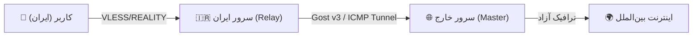

<div align="center">

# 🛡️ Nyx Panel (نیکس پنل)
### سامانه مدیریت اتصالات Xray-core با تمرکز بر پایداری در شبکه ایران

[](https://github.com/icynetx/Nyx)
[](https://github.com/icynetx/Nyx/blob/main/LICENSE)
[](https://github.com/XTLS/Xray-core)
[](https://vuejs.org/)
[](https://nodejs.org/)

<p align="center" dir="rtl">
  طراحی‌شده برای شرایط اختلالات پویای شبکه، مسدودی SNI و انتقال ترافیک بین سرور داخل و خارج
  <br />
  <code>VLESS + REALITY (X25519)</code> · <code>Packet Fragment</code> · ربات دکمه‌ای ادمین · وب‌صفحه اختصاصی مشترکین
</p>

[⚡ راهنمای نصب](#-راهنمای-نصب-سریع-روی-سرور-لینوکس) •
[🧩 توضیحات کامل امکانات](#-توضیحات-تفصیلی-امکانات-پنل) •
[🤖 راهنمای ربات تلگرام ادمین](#-راهنمای-کامل-پیکربندی-و-استفاده-از-ربات-تلگرام) •
[📱 راهنمای اتصال در کلاینت‌ها](#-راهنمای-استفاده-در-نرم‌افزارهای-کلاینت) •
[🌐 راهنمای تونل لینوکس](#-راهنمای-راه‌اندازی-تونل-انتقال-ترافیک-سرور-ایران-به-خارج)

</div>

---

<div dir="rtl">

## 📌 چرا Nyx Panel؟

در اختلالات شبکه در ایران، الگوریتم‌های تحلیل پکت (`DPI`) اپراتورها (همراه اول، ایرانسل و مخابرات) به صورت پویا تغییر می‌کنند. بسیاری از پنل‌های مدیریت به دلیل مصرف بالای منابع (رم بالای ۳۰۰ مگابایت)، پیچیدگی‌های ساختاری یا عدم پشتیبانی از ابزارهای پایش و تکنولوژی‌های جدید، هنگام اختلالات شدید دچار مشکل می‌شوند.

پروژه **Nyx Panel** با هدف ارائه یک راهکار سبک، امن و متمرکز بر تکنولوژی‌های روز `Xray` توسعه داده شده است. مصرف رم این پنل تنها حدود **۷۰ تا ۱۰۰ مگابایت** است و امکاناتی نظیر **ربات دکمه‌ای ادمین**، **صفحه وب مجزا برای هر کاربر**، **سنجش زنده SNI** و **اسکریپت‌ساز اتوماتیک تونل** را در اختیارتان قرار می‌دهد.

</div>

---

<div dir="rtl">

## 📊 جدول مقایسه فنی Nyx Panel با سایر پنل‌ها

</div>

<div dir="ltr" align="center">

| Feature / Capability | 🛡️ Nyx Panel v2.0 | 3x-ui (Sanaei) | Marzban |
|---|:---:|:---:|:---:|
| **RAM Footprint (Memory)** | **Lightweight (~70 MB)** | Moderate (~250 MB) | Heavy (~400 MB+) |
| **Token-based Authentication** | **Yes (Secure Auth)** | Yes | Yes |
| **Live Traffic Sync via gRPC** | **Yes (Every 20 seconds)** | Yes | Yes |
| **Live TLS SNI Handshake Tester** | **Built-in Panel Tool** | No | No |
| **100% Button-driven Telegram Bot** | **Yes (Step-by-step Wizard)** | Limited | Command-based |
| **Standalone User Web Page** | **Yes (`/subinfo/UUID`)** | No | Basic |
| **Intranet Tunnel Generator** | **Yes (Gost v3 / ICMP / DNS)** | No | No |
| **VLESS + REALITY Support** | **Yes (X25519 Keypair)** | Yes | Yes |

</div>

---

<div dir="rtl">

## 🧩 توضیحات تفصیلی امکانات پنل

### 🔒 ۱. پروتکل `VLESS + REALITY` با کلیدهای اختصاصی `X25519`
- **عدم نیاز به دامنه یا گواهی SSL:** شبیه‌سازی دست‌تکانی TLS به سمت دامنه‌های معتبر جهانی بدون نیاز به ثبت دامنه.
- **دسته‌بندی هوشمند دامنه‌های وانمودی (SNI):**
  - **مخازن نرم‌افزاری و توسعه:** `archive.ubuntu.com`, `pypi.org`, `registry.npmjs.org`, `download.docker.com`
  - **مراجع صدور گواهی SSL:** `acme-v02.api.letsencrypt.org`, `r3.o.lencr.org`, `ocsp.digicert.com`
  - **دامنه‌های زیرساختی و بانکی:** `ebanking.banksepah.ir`, `bmi.ir`, `arvancloud.ir`
- **کلیدهای اختصاصی X25519:** تولید اتوماتیک کلیدهای رمزشده اختصاصی برای هر اینباند (بدون استفاده از کلیدهای ثابت).

### ⚡ ۲. تکه‌تکه‌سازی پکت‌ها (`Xray Packet Fragment`)
- **عبور از سیستم‌های تحلیل پکت (`DPI`):** خرد کردن پکت‌های `TLS Client Hello` جهت کاهش حساسیت فیلترینگ.
- **تنظیمات اختصاصی بر اساس اپراتور:**
  - 📱 **همراه اول (MCI):** الگوی پکت `100-200,10-20,tlshello`
  - 📡 **ایرانسل (IRANCELL):** الگوی پکت `50-150,5-15,tlshello`
  - ⚡ **ترافیک شبکه استانی (WHITE_SNI):** الگوی پکت `10-100,2-10,tlshello`

### 🤖 ۳. ربات تلگرام ادمین (۱۰۰٪ دکمه‌ای و بدون نیاز به تایپ)
- **شناسایی هوشمند ادمین بر اساس `Chat ID`:** بدون نیاز به وارد کردن کلمه عبور در هر بار استفاده.
- **ساخت کاربر جدید مرحله‌به‌مرحله (Wizard):**
  1. لمس دکمه «➕ ساخت کاربر جدید»
  2. تایپ نام کاربر (مثلاً `ali`)
  3. انتخاب سقف حجم با دکمه‌های شیشه‌ای (`[۱۰ گیگ]`, `[۲۰ گیگ]`, `[۵۰ گیگ]`, `[نامحدود]`)
  4. انتخاب مدت زمان با دکمه‌های شیشه‌ای (`[۱ ماه]`, `[۲ ماه]`, `[۳ ماه]`, `[نامحدود]`)
  5. تحویل فوری لینک سابسکریپشن + وب‌صفحه اختصاصی کاربر به ادمین.
- **مدیریت کامل کاربران:** مشاهده لیست کاربران، دریافت لینک سابسکریپشن و حذف کاربر با دکمه‌های شیشه‌ای زیر هر کاربر.
- **استعلام ترافیک اتوماتیک برای کاربران:** پاسخگویی به دکمه‌های «📊 وضعیت حساب من» و «🔑 دریافت اشتراک من».

### 🌐 ۴. صفحه وب اختصاصی و مجزا برای هر کاربر (`/subinfo/:uuid`)
- **وب‌اپلیکیشن بدون نیاز به لاگین:** قابل مشاهده در هر مرورگر موبایل یا دسکتاپ با آدرس `http://SERVER_IP:3000/subinfo/UUID`.
- **نمایش نوار پیشرفت مصرف ترافیک (Progress Bar):** محاسبه حجم مصرف‌شده، حجم باقی‌مانده و درصد مصرف به گیگابایت.
- **روزهای باقی‌مانده و تاریخ انقضا:** محاسبه اتوماتیک روزهای اعتبار به همراه وضعیت فعال یا منقضی.
- **تغییر دهنده هوشمند اپراتورها:** دکمه‌های انتخاب سریع همراه اول، ایرانسل، عمومی و SNI سفید.
- **کپی ۱-کلیکه کدهای اتصال:** دریافت کدهای VLESS, Clash Meta YAML, Sing-Box JSON و Base64.
- **بارکد QR هوشمند:** اسکن مستقیم با دوربین گوشی توسط تمام نرم‌افزارهای کلاینت.

### 🧪 ۵. ابزار تست زنده دست‌تکانی TLS (`SNI Tester`)
- **ارزیابی زنده باز بودن SNI:** انجام دست‌تکانی TLS زنده از روی سرور روی پورت ۴۴۳ به همراه نمایش میزان تأخیر (`ms`) و مشخصات گواهی.
- **دستورات تست ترمینالی:** ارائه دستورات `curl` و `openssl` جهت تست دستی ادمین.

</div>

---

<div dir="rtl">

## 💻 راهنمای نصب سریع روی سرور لینوکس

دستور زیر را با دسترسی **root** در ترمینال سرور خود (اوبونتو، دبیان، سانتوس، آلمالینوکس) اجرا کنید:

</div>

<div dir="ltr">

```bash
curl -sSL "https://raw.githubusercontent.com/icynetx/Nyx/main/install.sh?v=3" | sudo bash
```

</div>

<div dir="rtl">

### 🔑 مراحل تعاملی هنگام نصب:
در ابتدای نصب، اسکریپت موارد زیر را از شما می‌پرسد (در صورت فشردن Enter، مقادیر پیش‌فرض تنظیم می‌شوند):
1. 👤 **نام کاربری ادمین** (پیش‌فرض: `admin`)
2. 🔐 **کلمه عبور ادمین** (پیش‌فرض: `nyx2026!`)
3. 🌐 **پورت اجرای پنل** (پیش‌فرض: `3000`)

پس از اتمام نصب، خروجی در ترمینال نمایش داده می‌شود:

</div>

<div dir="ltr">

```text
====================================================
✅ Nyx Panel Successfully Installed & Started!
====================================================
🌐 Dashboard Web UI: http://185.x.x.x:3000
👤 Admin Username:  admin
🔐 Admin Password:  nyx2026!
🔒 Status: Active & Systemd Enabled (nyx.service)
====================================================
```

</div>

---

<div dir="rtl">

## 🤖 راهنمای کامل پیکربندی و استفاده از ربات تلگرام

</div>


<div dir="rtl">

1. وارد تب **«ربات و تنظیمات»** در داشبورد وب پنل شوید.
2. توکن دریافت شده از [@BotFather](https://t.me/BotFather) را در بخش **Bot Token** وارد کنید.
3. چت‌آیدی عددی تلگرام خود را (از ربات [@userinfobot](https://t.me/userinfobot)) در بخش **Admin Chat ID** وارد کرده و دکمه **«ذخیره و شروع ربات»** را بزنید.
4. با پیام دادن به ربات، حساب شما به‌صورت ادمین شناسایی شده و منوی دکمه‌ای مدیریت برایتان فعال می‌شود!

</div>

---

<div dir="rtl">

## 📱 راهنمای استفاده در نرم‌افزارهای کلاینت

</div>

<div dir="ltr" align="center">

| Client Application | Platform | Input Configuration | How to Add |
|---|---|---|---|
| **Sing-Box** | Android / iOS / Windows | Subscription URL or JSON | Add Subscription / Remote |
| **V2rayN** | Windows | VLESS Link or Subscription | `Ctrl+V` or Add Subscription |
| **MahsaNG** | Android | VLESS Link / Subscription | Copy link and tap + |
| **Shadowrocket** | iOS (iPhone / iPad) | VLESS Link or QR Code | Scan QR Code or Paste Link |
| **Hiddify** | All Platforms | Subscription URL | Paste Subscription Link |
| **Clash Meta / Stash** | Windows / macOS / iOS | YAML File / Sub | Import YAML or Remote Sub |

</div>

---

<div dir="rtl">

## 🌐 راهنمای راه‌اندازی تونل انتقال ترافیک (سرور ایران به خارج)

در صورت بروز اختلال در ارتباط مستقیم با سرور خارج، ترافیک کاربران ابتدا به سرور داخل ایران هدایت شده و از طریق تونل امن به سرور خارج منتقل می‌شود:

</div>



<div dir="rtl">

1. وارد تب **«تونل قطعی نت»** در پنل شوید.
2. IP سرور خارج، پورت اینباند و پورت ارتباطی تونل را مشخص کنید.
3. متد مورد نظر (Gost v3، Rathole یا ICMP Ping Tunnel) را انتخاب کرده و دکمه **«تولید اسکریپت»** را بزنید.
4. اسکریپت تولیدشده سرور ایران را روی سرور داخل و اسکریپت سرور خارج را روی سرور خارج اجرا کنید.

</div>

---

<div dir="rtl">

## 🛠️ دستورات مدیریت سرویس در لینوکس (Systemd Commands)

- **مشاهده وضعیت سرویس:** `systemctl status nyx`
- **راه‌اندازی مجدد سرویس (Restart):** `systemctl restart nyx`
- **مشاهده لاگ‌های زنده سیستم:** `journalctl -u nyx -f`
- **توقف سرویس:** `systemctl stop nyx`

---

## 📄 لایسنس

این پروژه به صورت متن‌باز تحت لایسنس **MIT** منتشر شده است.

</div>
