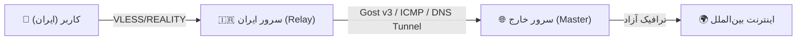

<div align="center">

# 🛡️ Nyx Panel (نیکس پنل)
### سامانه نسل جدید مدیریت ضد فیلترینگ و دور زدن قطعی اینترنت بین‌الملل (شبکه ملی اطلاعات)

[](https://github.com/icynetx/Nyx)
[](https://github.com/icynetx/Nyx/blob/main/LICENSE)
[](https://github.com/XTLS/Xray-core)
[](https://vuejs.org/)
[](https://nodejs.org/)

<p align="center">
  <b>طراحی‌شده برای شرایط بسیار سخت فیلترینگ، اختلالات پویای DPI و قطع کامل اینترنت بین‌الملل در ایران</b>
  <br />
  <i>مبتنی بر VLESS + REALITY (X25519) · Xray Packet Fragment · Gost v3 Tunnel · ICMP Ping Tunnel · White DNS Tunnel</i>
</p>

[⚡ نصب تک‌خطی](#-راهنمای-نصب-سریع-روی-سرور-لینوکس-fast-installation-guide) •
[✨ ویژگی‌های برجسته](#-ویژگی‌های-برجسته-key-features) •
[🤖 ربات تلگرام ادمین](#-ربات-تلگرام-ادمین-۱۰۰-دکمه‌ای-برجسته) •
[🌐 وب‌صفحه اختصاصی کاربر](#-صفحه-وب-اختصاصی-مشاهده-مشخصات-کاربر-subinfouuid) •
[🌐 تونل قطعی نت](#-تکنولوژی‌های-عبور-از-قطعی-نت-ملی-intranet-relay--tunneling)

---

</div>

> [!NOTE]
> **چرا Nyx Panel متولد شد؟**
> بیشتر پنل‌های موجود برای شرایط عادی طراحی شده‌اند و هنگام اعمال اختلالات شدید DPI، مسدودی دامنه‌های SNI یا قطع کامل اینترنت بین‌الملل (شبکه ملی اطلاعات) کارایی خود را از دست می‌دهند. **Nyx Panel** یک راهکار سبک، امن و متمرکز است که به طور تخصصی برای دور زدن فیلترینگ پویای اپراتورهای ایران (همراه اول، ایرانسل و مخابرات) پیاده‌سازی شده است.

---

## ⚡ جدول مقایسه Nyx Panel با سایر پنل‌ها

| قابلیت / ویژگی | 🛡️ Nyx Panel v2.0 | 3x-ui / Sanaei | Marzban |
|---|:---:|:---:|:---:|
| **مصرف رم (RAM Footprint)** | **فوق‌العاده سبک (~70 MB)** | متوسط (~250 MB) | نسبتاً سنگین (~400 MB+) |
| **ورود امنیتی (Auth) و توکن** | **دارد (Token-based Auth)** | دارد | دارد |
| **محاسبه ترافیک زنده از gRPC** | **✅ مستقیم از هسته (هر ۲۰ ثانیه)** | ✅ | ✅ |
| **تست زنده TLS SNI Handshake** | **✅ ابزار سنجش زنده در پنل** | ❌ | ❌ |
| **ربات تلگرام ۱۰۰٪ دکمه‌ای ادمین** | **✅ ساخت کاربر مرحله‌به‌مرحله با دکمه** | ⚠️ محدود | ⚠️ نیازمند تایپ دستور |
| **صفحه وب اختصاصی کاربر (بدون لاگین)** | **✅ طراحی مدرن + QR + انتخاب اپراتور** | ❌ | ⚠️ ساده |
| **اسکریپت‌ساز اتوماتیک تونل قطعی نت** | **✅ Gost v3 + Rathole + ICMP + DNS** | ❌ | ❌ |
| **عدم نیاز به دامنه/SSL برای کلاینت** | **✅ پشتیبانی کامل VLESS + REALITY** | ✅ | ✅ |

---

## ✨ ویژگی‌های برجسته (Key Features)

### 🔒 ۱. VLESS + REALITY با تولید کلیدهای رمزشده X25519
- **عدم نیاز به دامنه یا گواهی SSL:** شبیه‌سازی کامل دست‌تکانی TLS به سمت دامنه‌های معتبر جهانی بدون نیاز به ثبت دامنه.
- **دسته‌بندی هوشمند دامنه‌های وانمودی (SNI):**
  - مخازن نرم‌افزاری و توسعه (Ubuntu Archive, PyPI, NPM Registry, Docker) 👈 *احتمال دسترسی بالا در اختلالات شبکه*
  - مراجع صدور گواهی SSL (Let's Encrypt API, DigiCert, Sectigo)
  - دامنه‌های سفید و زیرساختی داخلی (همراه بانک سپه، بانک ملی، ابر آروان)
- **کلیدهای کاملاً اختصاصی:** عدم استفاده از کلیدهای ثابت؛ تولید کلیدهای منحصر‌به‌فرد X25519 برای هر اینباند.

### ⚡ ۲. تکه‌تکه‌سازی پکت‌ها (Xray Packet Fragment)
- **دور زدن DPI تحلیلی اپراتورها:** خرد کردن پکت‌های `TLS Client Hello` جهت عبور از سیستم‌های بازرسی عمیق پکت (DPI).
- **تنظیمات اختصاصی بر اساس اپراتور:**
  - 📱 **همراه اول (MCI):** تنظیم الگوی پکت `100-200,10-20,tlshello`
  - 📡 **ایرانسل (IRANCELL):** تنظیم الگوی پکت `50-150,5-15,tlshello`
  - ⚡ **ترافیک شبکه ملی (WHITE_SNI):** تنظیم پکت برای عبور از دامنه‌های سفید استانی.

### 🤖 ۳. ربات تلگرام ادمین (۱۰۰٪ دکمه‌ای و بدون نیاز به تایپ)
- **شناسایی هوشمند ادمین بر اساس Chat ID:** بدون نیاز به لاگین مجدد در تلگرام.
- **ساخت کاربر جدید مرحله‌به‌مرحله (Wizard):**
  1. لمس دکمه «➕ ساخت کاربر جدید»
  2. تایپ نام کاربر
  3. انتخاب حجم با دکمه‌های شیشه‌ای (`[۱۰ گیگ]`, `[۲۰ گیگ]`, `[۵۰ گیگ]`, `[نامحدود]`)
  4. انتخاب مدت با دکمه‌های شیشه‌ای (`[۱ ماه]`, `[۲ ماه]`, `[۳ ماه]`, `[نامحدود]`)
  5. تحویل لحظه‌ای لینک مستقیم سابسکریپشن + وب‌صفحه اختصاصی به ادمین!
- **مدیریت کامل کاربران:** مشاهده لیست، دریافت لینک و حذف کاربر با دکمه‌های شیشه‌ای زیر هر کاربر.
- **استعلام ترافیک خودکار برای کاربران عادی:** پاسخگویی به دستورات `/usage` و `/sub`.

### 🌐 ۴. صفحه وب اختصاصی و مجزا برای هر کاربر (`/subinfo/:uuid`)
- **وب‌اپلیکیشن بدون نیاز به لاگین:** قابل مشاهده در هر مرورگر موبایل یا دسکتاپ با آدرس `http://SERVER_IP:3000/subinfo/UUID`.
- **نمایش نوار پیشرفت مصرف ترافیک (Progress Bar):** محاسبه گیگابایت مصرف‌شده، گیگابایت باقی‌مانده و درصد مصرف.
- **روزهای باقی‌مانده و تاریخ انقضا:** محاسبه اتوماتیک روزهای اعتبار همراه با وضعیت فعال یا منقضی.
- **تغییر دهنده هوشمند اپراتورها:** دکمه‌های انتخاب سریع همراه اول، ایرانسل، عمومی و SNI سفید.
- **کپی ۱-کلیکه کدهای اتصال:** دریافت کدهای VLESS, Clash Meta YAML, Sing-Box JSON و Base64.
- **بارکد QR هوشمند:** اسکن مستقیم با دوربین گوشی توسط تمام نرم‌افزارهای کلاینت.

### 🧪 ۵. ابزار تست زنده دست‌تکانی TLS (SNI Tester)
- **ارزیابی زنده باز بودن SNI:** انجام دست‌تکانی TLS زنده از روی سرور روی پورت ۴۴۳ به همراه نمایش میزان تأخیر (ms) و صادرکننده گواهی.
- **ارائه دستورات تست ترمینالی:** تولید دستورات `curl` و `openssl` برای تست دستی از روی سیستم شخصی ادمین.

---

## 💻 راهنمای نصب سریع روی سرور لینوکس (Fast Installation Guide)

> [!IMPORTANT]
> اسکریپت نصب روی تمامی توزیع‌های معتبر لینوکس (**Ubuntu, Debian, CentOS, AlmaLinux, Rocky Linux**) به صورت خودکار تمامی نیازمندی‌ها (Node.js, Prisma, Xray-core) را نصب و آماده می‌کند.

برای نصب تنها کافیست دستور زیر را با دسترسی **root** در ترمینال سرور خود اجرا کنید:

```bash
curl -sSL "https://raw.githubusercontent.com/icynetx/Nyx/main/install.sh?v=3" | sudo bash
```

### 🔑 مراحل تعاملی هنگام نصب:
در ابتدای نصب، اسکریپت موارد زیر را از شما می‌پرسد (در صورت فشردن Enter، مقادیر پیش‌فرض تنظیم می‌شوند):
1. 👤 **نام کاربری ادمین** (پیش‌فرض: `admin`)
2. 🔐 **کلمه عبور ادمین** (پیش‌فرض: `nyx2026!`)
3. 🌐 **پورت اجرای پنل** (پیش‌فرض: `3000`)

پس از اتمام نصب، خروجی به شکل زیر در ترمینال نمایش داده می‌شود:
```text
====================================================
✅ Nyx Panel Successfully Installed & Started!
====================================================
🌐 Dashboard Web UI: http://185.x.x.x:3000
👤 Admin Username:  admin
🔐 Admin Password:  nyx2026!
🔒 Status: Active & Systemd Enabled (nyx.service)
====================================================
```

---

## 🤖 راهنمای پیکربندی ربات تلگرام ادمین (Telegram Bot Setup)

راه‌اندازی ربات تلگرام تنها در دو گام از طریق وب‌پنل انجام می‌شود:


1. وارد تب **«ربات و تنظیمات»** در داشبورد وب پنل شوید.
2. توکن دریافت شده از [@BotFather](https://t.me/BotFather) را در بخش **Bot Token** وارد کنید.
3. چت‌آیدی عددی تلگرام خود را (از ربات [@userinfobot](https://t.me/userinfobot)) در بخش **Admin Chat ID** وارد کرده و دکمه **«ذخیره و شروع ربات»** را بزنید.
4. اکنون به ربات خود پیام دهید؛ ربات شما را اتوماتیک به‌عنوان ادمین شناسایی کرده و منوی دکمه‌ای را برایتان باز می‌کند!

---

## 🌐 تکنولوژی‌های عبور از قطعی نت ملی (Intranet Relay & Tunneling)

هنگام قطع کامل اینترنت بین‌الملل، ترافیک کاربران باید از سرور داخل ایران به سرور خارج منتقل شود. **Nyx Panel** دارای یک اسکریپت‌ساز اتوماتیک است که دستورات نصب ۱-کلیکه زیر را تولید می‌کند:



1. **🔒 Gost v3 (WebSocket Encrypted Tunnel - پیشنهادی):** انتقال انکریپت‌شده ترافیک روی پورت‌های عمومی با Secret رمزشده.
2. **⚡ ICMP Ping Tunnel (PingTunnel):** عبور ترافیک در قالب پکت‌های پینگ ICMP (کارآمد هنگامی که تمامی پورت‌های TCP/UDP مسدود هستند).
3. **📡 White DNS Tunnel (dnstt):** عبور ترافیک از طریق پورت ۵۳ و سرورهای دی‌ان‌اس سفید داخلی.
4. **🐀 Rathole Tunnel:** تونل بسار سریع، سبک و امن مبتنی بر زبان Rust.

---

## 🛠️ دستورات مدیریت سرویس در لینوکس (Systemd Commands)

بررسی و مدیریت سرویس پس‌زمینه `nyx.service`:

- **بررسی وضعیت اجرای پنل:**
  ```bash
  systemctl status nyx
  ```
- **راه‌اندازی مجدد پنل (Restart):**
  ```bash
  systemctl restart nyx
  ```
- **مشاهده لاگ‌های زنده سیستم:**
  ```bash
  journalctl -u nyx -f
  ```
- **توقف سرویس:**
  ```bash
  systemctl stop nyx
  ```

---

## 🔒 ملاحظات امنیتی و معماری (Security & Architecture)

- **احراز هویت کامل APIها:** تمام مسیرهای مدیریتی پنل نیاز به توکن معتبر دارند.
- **جلوگیری از تغییرات ناخواسته (Mass Assignment Protection):** پارامترهای ورودی تمامی APIها فیلتر و اعتبارسنجی می‌شوند.
- **عدم ذخیره کلیدهای هاردکد:** تولید کلیدهای رمزشده دائم و پویا.
- **پایگاه داده مستقل:** استفاده از SQLite و Prisma ORM بدون نیاز به نصب سرویس‌های سنگین دیتابیس خارجی.

---

## 📄 لایسنس و مشارکت (License & Support)

این پروژه تحت لایسنس **MIT** به صورت کاملاً رایگان و متن‌باز (Open Source) توسعه داده شده است. هدف این پروژه حمایت از **حق دسترسی آزاد به اطلاعات و اینترنت بدون سانسور** برای همگان است.

اگر این پروژه برای شما مفید بود، می‌توانید با دادن ⭐ (Star) به مخزن گیت‌هاب از توسعه آن حمایت کنید!
