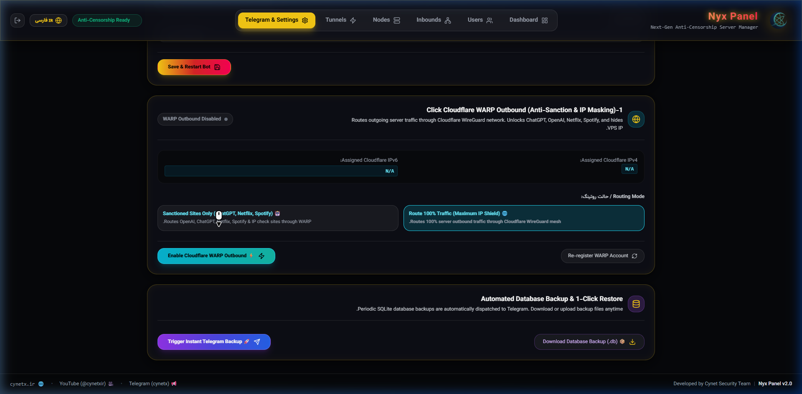
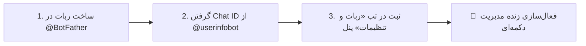
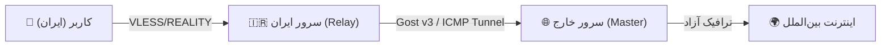

<div align="center">

<p align="center">
  
</p>

# 🛡️ Nyx Panel (نیکس پنل)
### سامانه پیشرفته مدیریت اتصالات Xray-core متمرکز بر شبکه و فیلترینگ ایران
#### 🔐 توسعه داده‌شده توسط تیم امنیتی ساینت (Cynet Security Team)

[](https://github.com/icynetx/Nyx)
[](#-3-راه‌اندازی-رایگان-روی-سرورهای-ابری-railway--render--docker)
[](https://github.com/icynetx/Nyx)
[](https://t.me/cynetx)
[](https://youtu.be/pFEeQrtCg14)
[](https://cynetx.ir)
[](https://github.com/icynetx/Nyx/blob/main/LICENSE)

<p align="center">
  <b>Language Options / تغییر زبان:</b>
  <br />
  <b>🇮🇷 Persian (فارسی)</b> • <a href="README_EN.md">🇺🇸 English</a>
</p>

<p align="center" dir="rtl">
  طراحی‌شده برای شرایط اختلالات شبکه، مسدودی SNI و انتقال ترافیک بین سرور داخل و خارج
  <br />
  <code>VLESS + REALITY (X25519)</code> · <code>Packet Fragment</code> · <code>Auto-Failover SNI</code> · <code>Cloudflare WARP</code> · <code>Auto Backup</code>
</p>

<p align="center">
  <a href="https://youtu.be/pFEeQrtCg14" target="_blank">
    
  </a>
  <br />
  <br />
  <a href="https://youtu.be/pFEeQrtCg14" target="_blank">
    
  </a>
  <br />
  <br />
  <a href="https://youtu.be/pFEeQrtCg14" target="_blank">
    <span dir="rtl">🔴 <b>جهت تماشای ویدیو معرفی و آموزش کامل در یوتیوب کلیک کنید</b> 🔴</span>
  </a>
</p>

[⚡ راهنمای نصب سریع](#-راهنمای-نصب-سریع-روی-سرور-لینوکس-و-ویندوز) •
[☁️ راه‌اندازی رایگان ابری و داکر](#-3-راه‌اندازی-رایگان-روی-سرورهای-ابری-railway--render--docker) •
[⚛️ موتور Quantum MultiPath](#-موتور-quantum-multipath-engine-v230---بمب-اصلی-این-نسخه) •
[🚀 قابلیت‌های جدید v2.3](#-قابلیت‌های-جدید-در-نسخه-v230-release-highlights) •
[📊 جدول مقایسه فنی](#-جدول-مقایسه-فنی-nyx-panel-با-سایر-پنل‌ها) •
[🧩 توضیحات کامل امکانات](#-توضیحات-تفصیلی-امکانات-پنل) •
[🤖 راهنمای ربات تلگرام](#-راهنمای-کامل-پیکربندی-و-استفاده-از-ربات-تلگرام) •
[📱 اتصال کلاینت‌ها](#-راهنمای-استفاده-در-نرم‌افزارهای-کلاینت) •
[🗑️ راهنمای حذف](#-راهنمای-حذف-کامل-و-پاکسازی-پنل-uninstallation-guide)

</div>

---

<div dir="rtl">

## ⚛️ موتور Quantum MultiPath Engine v2.3.0 — بمب اصلی این نسخه

> 🔥 **مشکلی که هیچ پنلی حل نکرده بود، امروز حل شد.**

### مشکل واقعی:
در قطعی‌های سنگین ایران (مانند شب‌های قطعی گسترده همراه اول و ایرانسل)، حتی با بهترین پروتکل‌ها (VLESS Reality، Fragment)، اتصال کاربر کامل قطع می‌شود. کاربر هیچ راهی ندارد و باید منتظر بنشیند.

### راه‌حل — Nyx Quantum MultiPath Engine:
**موتور مسیریابی چندگانه کوانتومی** که **۴ مسیر اتصال مختلف را به صورت همزمان** پایش می‌کند:

```
🛡️ مسیر ۱ (عادی):     VLESS + REALITY مستقیم ──► اینترنت آزاد ✅
☁️ مسیر ۲ (DPI قطعی): CDN ایرانی (ابر آروان PoP) ──► سرور ──► اینترنت ✅
🌐 مسیر ۳ (سنگین):    DNS Tunnel روی پورت ۵۳ ──► اینترنت ✅  
📡 مسیر ۴ (اضطراری):  تونل ICMP Ping ──► اینترنت ✅
```

### قابلیت‌های ۴ گانه:

| قابلیت | توضیح |
|--------|-------|
| **🔄 Auto-Switch** | هر ۱۵ ثانیه ۴ مسیر همزمان تست می‌شوند. بهترین مسیر خودکار انتخاب می‌شود. |
| **📊 Smart Subscription** | سابسکریپشن کاربر همیشه سالم‌ترین سرور را اول نشان می‌دهد (Load Balancer). |
| **🚨 Panic Mode** | در قطعی ۱۰۰٪، هشدار فوری به تلگرام ادمین + بازیابی خودکار اعلام می‌شود. |
| **📡 Dashboard Live** | داشبورد زنده وضعیت ۴ مسیر را با لتنسی و امتیاز سلامت نشان می‌دهد. |

### مقایسه قبل و بعد:

| شرایط شبکه | قبل از v2.3 | بعد از v2.3 |
|------------|-------------|-------------|
| شرایط عادی | ✅ متصل | ✅ متصل با سریع‌ترین مسیر |
| DPI سنگین اپراتور | ❌ قطع / تغییر دستی | ✅ سوئیچ خودکار در ۱۵ ثانیه |
| قطعی سنگین بین‌الملل | ❌ قطع کامل | ✅ سوئیچ به CDN ایرانی |
| قطعی ۱۰۰٪ بین‌الملل | ❌ قطع / بی‌چاره | ✅ Panic Mode + DNS Tunnel |
| سرور پر ترافیک | ❌ کند | ✅ Load Balance خودکار |

---

## 🚀 قابلیت‌های جدید در نسخه v2.3.0 (Release Highlights)

> [!TIP]
> ### ⚛️ 1. موتور پایش و مسیریابی زنده ۴ مسیره (Quantum MultiPath Engine)
> * **پایش موازی در هر ۱۵ ثانیه:** پایش همزمان ۴ مسیر ارتباطی مختلف بدون تداخل با پردازش موازی (`Promise.allSettled`).
> * **پوشش ۴ لایه شبکه:** مسیر ۱ (مستقیم VLESS Reality)، مسیر ۲ (CDN ابر آروان در شرایط DPI)، مسیر ۳ (پورت ۵۳ تونل DNS برای قطعی‌های سنگین) و مسیر ۴ (پینگ لایه ۳ ICMP).
> * **سوئیچ هوشمند:** در صورت افت کیفیت یک مسیر، بدون قطعی کاربر بهترین مسیر جایگزین می‌شود.

> [!IMPORTANT]
> ### ⚖️ 2. لودبالانسر هوشمند و اولویت‌بندی سابسکریپشن (Smart Health Load Balancer)
> * **رتبه‌بندی لحظه‌ای سرورها:** هر ۳۰ ثانیه تمام اینباندهای فعال بر اساس لتنسی، نرخ آپتایم و پایداری نمره‌دهی (۰ تا ۱۰۰) می‌شوند.
> * **بهترین سرور همیشه در ردیف اول (#1):** هر زمان کاربر یا کلاینت لینک سابسکریپشن را آپدیت کند، پایدارترین و سریع‌ترین سرور به صورت خودکار در بالاترین ردیف قرار می‌گیرد.

> [!CAUTION]
> ### 🚨 3. سیستم مدیریت بحران و آژیر قطعی کامل (Panic Mode Emergency Response)
> * **تشخیص قطعی ۱۰۰٪ بین‌الملل:** استفاده از منطق Hysteresis (نیاز به ۳ تست متوالی ناموفق برای جلوگیری از آلارم کاذب).
> * **ارسال گزارش فوری به تلگرام ادمین:** اطلاع‌رسانی بلادرنگ قطعی نت به ربات تلگرام ادمین و ارسال پیام رفع بحران به همراه مدت زمان دقیق قطعی (دقیقه و ثانیه) پس از اتصال مجدد.

> [!NOTE]
> ### 📊 4. داشبورد زنده پایش مسیرهای اینترنت ایران (Live Network Health Dashboard)
> * **کارت‌های زنده ۴ مسیر:** نمایش زنده پینگ (ms)، امتیاز پایداری با رنگ‌بندی داینامیک و برچسب `★ BEST` برای مسیر بهینه.
> * **دکمه تست اجباری (Force Recheck):** امکان سنجش فوری وضعیت هر ۴ مسیر تنها با ۱ کلیک از پنل وب.

> [!TIP]
> ### 🎨 5. بازطراحی کامل UI/UX و پنل شیشه‌ای لوکس و گرم (Warm Luxury Glassmorphism & Soft UI)
> * **پالت رنگی گرم و چشم‌نواز:** جایگزینی تم‌های تند و سنگین نئونی با ابسیدین گرم عمیق، گرادیانت‌های لطیف کهربایی (`Amber Gold`)، زمردی (`Emerald`) و رز (`Rose`) همراه با هاله‌های نوری محو معلق (`Ambient Glows`).
> * **ریسپانسیو ۱۰۰٪ بی‌نقص روی گوشی‌های موبایل:** بهینه‌سازی کامل المان‌ها، پدینگ‌ها، دکمه‌ها و منوهای لمسی برای تمامی دیوایس‌ها (گوشی، تبلت و دسکتاپ).

---

## 📦 قابلیت‌های کلیدی نسخه v2.2.0 (Previous Highlights)

> [!TIP]
> ### 💾 1. بکاپ‌گیری اتوماتیک دیتابیس در تلگرام و ریستور 1-کلیکه (Auto DB Backup & 1-Click Restore)
> * **بکاپ‌گیری 24 ساعته اتوماتیک:** ارسال خودکار فایل دیتابیس رمزشده به تلگرام ادمین با هش SHA-256.
> * **ریستور 1-کلیکه در ۳ ثانیه:** با ارسال مجدد فایل بکاپ به ربات، کل سیستم و کاربران فوراً بازیابی می‌شوند.

> [!IMPORTANT]
> ### 🛡️ 2. سامانه هوشمند سوئیچ اتوماتیک SNI (Smart Auto-Failover SNI Daemon)
> * پایش لایو اتصال TLS تمام اینباندها و سوئیچ هوشمند به دامنه‌های لیست سفید در زمان فیلتر شدن SNI بدون تغییر لینک کاربران.

> [!NOTE]
> ### 🌐 3. خروجی 1-کلیکه کلودفلر WARP و کنترل سرویس (Cloudflare WARP Outbound & System Control)
> * رفع تحریم کامل OpenAI، ChatGPT، Netflix و مخفی‌سازی IP اصلی سرور به همراه امکان ریستارت پنل از وب‌داشبورد.

<br />

<p align="center">
  
  <br />
  <i>نمای تب تنظیمات، خروجی کلودفلر WARP و بکاپ‌گیری اتوماتیک دیتابیس</i>
</p>

</div>

---

<div dir="rtl">

## 📌 چرا Nyx Panel؟

در اختلالات شبکه در ایران، الگوریتم‌های تحلیل پکت (`DPI`) اپراتورها (همراه اول، ایرانسل و مخابرات) مدام تغییر می‌کنند. اکثر پنل‌های موجود به دلیل مصرف بالای منابع (رم بالای 300 مگابایت)، پیچیدگی‌های ساختاری یا عدم پشتیبانی از ابزارهای پایش، هنگام اختلالات شدید دچار قطع اتصال می‌شوند.

پروژه **Nyx Panel** با هدف ارائه یک راهکار سبک، امن و متمرکز بر تکنولوژی‌های روز `Xray` توسعه داده شده است. مصرف رم این پنل تنها حدود **70 تا 100 مگابایت** است و امکاناتی نظیر **ربات دکمه‌ای ادمین**، **صفحه وب مجزا برای هر کاربر**، **سنجش زنده SNI**، **سوئیچ اتوماتیک SNI** و **اسکریپت‌ساز اتوماتیک تونل** را در اختیارتان قرار می‌دهد.

</div>

---

<div dir="rtl">

## 📊 جدول مقایسه فنی Nyx Panel با سایر پنل‌ها

</div>

<div dir="ltr" align="center">

| Feature / Capability | 🛡️ Nyx Panel v2.3 | 3x-ui (Sanaei) | Marzban |
|---|:---:|:---:|:---:|
| **⚛️ Quantum MultiPath 4-Route Engine** | **Yes (4 Parallel Live Routes)** | No | No |
| **⚖️ Smart Health Load Balancer for Subscriptions** | **Yes (Auto-sorts healthiest server)** | No | No |
| **🚨 Panic Mode Blackout Detection & Telegram Alert** | **Yes (Hysteresis-based)** | No | No |
| **Cross-Platform (Linux + Windows Server)** | **Yes (Native PowerShell + Bash)** | Linux Only | Linux Only |
| **RAM Footprint (Memory)** | **Lightweight (~70 MB)** | Moderate (~250 MB) | Heavy (~400 MB+) |
| **Automated Telegram DB Backup & 1-Click Restore** | **Yes (Auto 24h & Telegram Upload)** | Complex Manual | Manual Script |
| **Smart Auto-Failover SNI Daemon** | **Yes (DPI Blackout Auto-Switch)** | No | No |
| **1-Click Cloudflare WARP Outbound** | **Yes (Anti-Sanction & IP Shield)** | Complex Manual | Complex Manual |
| **Token-based Authentication** | **Yes (Secure Auth)** | Yes | Yes |
| **Live Traffic Sync via gRPC** | **Yes (Every 20 seconds)** | Yes | Yes |
| **Live TLS SNI Handshake Tester** | **Built-in Panel Tool** | No | No |
| **100% Button-driven Telegram Bot** | **Yes (Step-by-step Wizard)** | Limited | Command-based |
| **Standalone User Web Page** | **Yes (`/subinfo/UUID`)** | No | Basic |
| **Intranet Tunnel Generator** | **Yes (Gost v3 / ICMP / DNS)** | No | No |
| **VLESS + REALITY Support** | **Yes (X25519 Keypair)** | Yes | Yes |

</div>

---

> [!NOTE]
> **متمایز از سایر پنل‌ها:** پنل Nyx علاوه بر لینوکس، به صورت کاملاً نیتیو <span dir="ltr">`(Native)`</span> روی **سرورهای ویندوزی <span dir="ltr">`(Windows Server 2016 / 2019 / 2022 / 10 / 11)`</span>** نصب و اجرا می‌شود!

---

<div dir="rtl">

## 💻 راهنمای نصب سریع روی سرور لینوکس و ویندوز

### 🐧 1. نصب روی سرور لینوکس (Linux - Ubuntu/Debian/CentOS):
دستور زیر را با دسترسی **root** در ترمینال لینوکس اجرا کنید:

</div>

<div dir="ltr">

```bash
bash <(curl -Ls https://raw.githubusercontent.com/icynetx/Nyx/main/install.sh)
```

</div>

<div dir="rtl">

---

### 🪟 2. نصب روی سرور ویندوز (Windows Server / Windows 10/11):
ترمینال **PowerShell** را به صورت **Run as Administrator** باز کرده و دستور زیر را اجرا کنید:

</div>

<div dir="ltr">

```powershell
iwr -useb https://raw.githubusercontent.com/icynetx/Nyx/main/install.ps1 | iex
```

</div>

<div dir="rtl">

---

### ☁️ 3. راه‌اندازی رایگان روی سرورهای ابری (Railway / Render / Docker):

اگر سرور مجازی (VPS) ندارید یا نمی‌خواهید هزینه ماهانه سرور خارجی پرداخت کنید، می‌توانید پنل Nyx را روی پلتفرم‌های ابری رایگان مثل **Railway.app** بالا بیاورید.

#### 💡 مزایای راه‌اندازی روی سرورهای ابری (Railway):
* 💸 **بدون نیاز به خرید سرور:** بدون پرداخت هیچ هزینه‌ای پنل و فیلترشکن اختصاصی خودتان را روشن کنید.
* 🛡️ **عبور از فیلترینگ با شبکه CDN و HTTPS:** ترافیک در قالب پروتکل **VLESS WebSocket روی پورت امن ۴۴۳ با گواهی TLS** رد و بدل می‌شود و فیلترچی نمی‌تواند IP را مسدود کند.
* ⚡ **پایداری بالا:** مجهز به سیستم مالتی‌پلکسر هوشمند وب‌سوکت برای حفظ دائمی اتصال در شرایط اختلال نت.

---

#### 🚀 راهنمای قدم‌به‌قدم راه‌اندازی روی Railway (در کمتر از ۱ دقیقه):

> [!NOTE]
> برای استفاده از Railway فقط به یک **اکانت ساده و رایگان گیت‌هاب (GitHub)** نیاز دارید و هیچ کارت اعتباری یا شماره خارجی لازم نیست.

1. **ورود به سایت:** وارد سایت [railway.com](https://railway.com) شوید و با زدن روی **Login with GitHub** وارد شوید.
2. **ساخت پروژه:** روی دکمه بنفش **`+ New Project`** در بالای صفحه کلیک کنید.
3. **اتصال به گیت‌هاب:** گزینه **`Deploy from GitHub repo`** را انتخاب کنید.
4. **انتخاب پروژه Nyx:** آدرس مخزن را جستجو کرده یا عبارت زیر را وارد کنید:
   ```text
   icynetx/Nyx
   ```
   *(یا مستقیماً آدرس کامل `https://github.com/icynetx/Nyx`)*
5. **شروع راه‌اندازی:** روی دکمه **`Deploy Now`** کلیک کنید. ریلوِی به صورت خودکار پروژه را بیلد کرده و هسته Xray و پنل را روشن می‌کند (حدود ۱ دقیقه زمان می‌برد).
6. **گرفتن دامنه اینترنتی رایگان (HTTPS):**
   * بعد از اینکه وضعیت سرویس سبز شد (`Active 🟢`)، روی باکس پروژه کلیک کنید.
   * وارد تب **Settings** شوید.
   * به سمت پایین اسکرول کنید تا به بخش **Networking** برسید.
   * روی دکمه **Generate Domain** کلیک کنید. ریلوِی یک دامنه اختصاصی HTTPS رایگان (مثلاً `nyx-production.up.railway.app`) به شما می‌دهد.
7. **ورود به پنل و ساخت کانفیگ:**
   * آدرس دامنه را در مرورگر باز کنید.
   * با مشخصات پیش‌فرض زیر وارد پنل شوید:
     * **نام کاربری:** `admin`
     * **رمز عبور:** `nyx2026!`
   * وارد بخش **کاربران** شوید و لینک سابسکریپشن را کپی کنید.
   * کانفیگ‌های `⚡ Railway-Cloud-WSS` به صورت خودکار روی پورت ۴۴۳ تولید شده و در اپلیکیشن‌های v2rayNG ،Streisand ،Shadowrocket و... آماده اتصال هستند!

---

#### 🐳 اجرای با Docker و Docker Compose (روی سرور شخصی):

اگر سرور لینوکس شخصی دارید و می‌خواهید پنل را با داکر بالا بیاورید:

</div>

<div dir="ltr">

```bash
# اجرا با Docker Compose
docker-compose up -d

# یا اجرا به صورت مستقیم با داکر
docker run -d \
  --name nyx-panel \
  -p 3000:3000 \
  -p 443:443 \
  -v nyx_data:/data \
  --restart unless-stopped \
  ghcr.io/icynetx/nyx:latest
```

</div>

<div dir="rtl">

### 🔑 مراحل تعاملی هنگام نصب:
در ابتدای نصب، اسکریپت موارد زیر را از شما می‌پرسد (در صورت فشردن Enter، مقادیر پیش‌فرض تنظیم می‌شوند):
1. 👤 **نام کاربری ادمین** (پیش‌فرض: `admin`)
2. 🔐 **کلمه عبور ادمین** (پیش‌فرض: `nyx2026!`)
3. 🌐 **پورت اجرای پنل** (پیش‌فرض: `3000`)

پس از اتمام نصب، اطلاعات ورود به پنل در ترمینال نمایش داده می‌شود:

</div>

<div dir="ltr">

```text
====================================================
✅ Nyx Panel Successfully Installed & Started!
====================================================
🌐 Dashboard Web UI: http://YOUR_SERVER_IP:3000
👤 Admin Username:  admin
🔐 Admin Password:  nyx2026!
🔒 Status: Active & Systemd Enabled (nyx.service)
====================================================
```

</div>

---

<div dir="rtl">

## 🧩 توضیحات تفصیلی امکانات پنل

### 📦 1. بکاپ‌گیری اتوماتیک دیتابیس در تلگرام و ریستور 1-کلیکه (Auto DB Backup & 1-Click Restore v2.2)
- **ارسال اتوماتیک فایل دیتابیس به تلگرام:** سرویس پس‌زمینه هوشمند که هر 24 ساعت یک‌بار فایل کامل دیتابیس رمزشده (`.db`) شامل تمام کاربران، حجم‌ها، تاریخ‌ها و اینباندها را مستقیم به پیوی تلگرام ادمین ارسال می‌کند.
- **ریستور 1-کلیکه در سرور جدید (1-Click Restore):** در صورت سوختن هارد سرور یا خرید VPS جدید، کافیست فایل `.db` بکاپ را در ربات تلگرام آپلود کنید؛ پنل در 3 ثانیه دیتابیس را بازگردانی کرده و تمام کاربران را زنده می‌کند!
- **بررسی کد SHA-256:** جهت اطمینان از سلامت کامل فایل بکاپ هنگام انتقال شبکه.
- **دانلود مستقیم و کلید دستی در وب‌پنل:** امکان دریافت فایل بکاپ از تب تنظیمات و ارسال دکمه‌ای به تلگرام.

### 🛡️ 2. سامانه هوشمند سوئیچ اتوماتیک SNI در زمان قطعی نت (Smart Auto-Failover v2.1)
- **پایش لایو پس‌زمینه (Background Daemon):** تست خودکار و مداوم اتصال TLS 1.3 تمام اینباندهای فعال هر 60 ثانیه.
- **تشخیص اتوماتیک مسدودی اپراتورها (DPI Detection):** اگر دامنه‌ای روی همراه اول یا ایرانسل فیلتر بشه، پنل بلافاصله مسدودی را تشخیص می‌دهد.
- **سوئیچ بدون تغییر لینک کاربران (Seamless Whitelist Fallback):** به صورت هوشمند سالم‌ترین دامنه لیست سفید (مانند `ebanking.banksepah.ir` یا `arvancloud.ir`) را جایگزین دامنه مسدودشده کرده و هسته Xray را ریلود می‌کند. **لینک سابسکریپشن کاربران بدون نیاز به تغییر متصل می‌ماند!**
- **هشدار فوری تلگرام:** ارسال گزارش کامل سوئیچ به همراه میزان تاخیر میلی‌ثانیه‌ای به پیوی تلگرام ادمین.
- **دکمه اجرای دستی 1-کلیکه:** امکان اجرای پایش و سوئیچ آنی از طریق وب‌پنل و دکمه `🛡️ Auto-Failover SNI` در ربات تلگرام.

### 🌐 3. خروجی 1-کلیکه کلودفلر WARP (رفع تحریم و مخفی‌سازی IP سرور)
- **ساخت اتوماتیک اکانت WireGuard کلودفلر:** دریافت مستقیم IP و کلیدهای اختصاصی IPv4/v6 از API رسمی کلودفلر.
- **رفع تحریم کامل وب‌سایت‌های بین‌المللی:** باز کردن اتوماتیک سایت‌های تحریمی نظیر `ChatGPT`, `OpenAI`, `Netflix`, `Spotify`.
- **مخفی‌سازی IP اصلی سرور (IP Shielding):** ترافیک خروجی سرور از شبکه WireGuard کلودفلر رد شده و IP اصلی VPS شما از دید دیتاسنترها و فیلترینگ مخفی می‌ماند.
- **دو حالت روتینگ هوشمند:**
  - 🌐 **ترافیک 100٪ (ALL):** روت کل ترافیک سرور از کلودفلر برای بالاترین سطح امنیت.
  - 🤖 **سایت‌های تحریمی (SANCTIONED):** روت هوشمند فقط سرویس‌های تحریمی و هوش مصنوعی.
- **مدیریت از ربات تلگرام و وب‌پنل:** فعال‌سازی/غیرفعال‌سازی 1-کلیکه از تب تنظیمات یا دکمه `🌐 Cloudflare WARP` در ربات تلگرام.

### 🔒 4. پروتکل `VLESS + REALITY` با کلیدهای اختصاصی `X25519`
- **عدم نیاز به دامنه یا گواهی SSL:** شبیه‌سازی اتصال واقعی TLS به سمت دامنه‌های معتبر جهانی بدون نیاز به ثبت دامنه.
- **دامنه‌های واقعی شبیه‌سازی‌شده (SNI):**
  - **مخازن نرم‌افزاری و توسعه:** `archive.ubuntu.com`, `pypi.org`, `registry.npmjs.org`, `download.docker.com`
  - **مراجع صدور گواهی SSL:** `acme-v02.api.letsencrypt.org`, `r3.o.lencr.org`, `ocsp.digicert.com`
  - **دامنه‌های زیرساختی و بانکی:** `ebanking.banksepah.ir`, `bmi.ir`, `arvancloud.ir`
- **کلیدهای اختصاصی X25519:** تولید اتوماتیک کلیدهای رمزشده اختصاصی برای هر اینباند (بدون استفاده از کلیدهای ثابت).

### ⚡ 5. تکه‌تکه‌سازی پکت‌ها (`Xray Packet Fragment`)
- **عبور از سیستم‌های تحلیل پکت (`DPI`):** خرد کردن پکت‌های `TLS Client Hello` جهت کاهش حساسیت فیلترینگ.
- **تنظیمات اختصاصی بر اساس اپراتور:**
  - 📱 **همراه اول (MCI):** الگوی پکت `100-200,10-20,tlshello`
  - 📡 **ایرانسل (IRANCELL):** الگوی پکت `50-150,5-15,tlshello`
  - ⚡ **ترافیک شبکه استانی (WHITE_SNI):** الگوی پکت `10-100,2-10,tlshello`

### 🤖 6. ربات تلگرام ادمین (100٪ دکمه‌ای و بدون نیاز به تایپ)
- **ورود خودکار ادمین با `Chat ID`:** بدون نیاز به تایپ پسورد در هر بار استفاده.
- **ساخت کاربر جدید مرحله‌به‌مرحله (Wizard):**
  1. لمس دکمه «➕ ساخت کاربر جدید»
  2. تایپ نام کاربر (مثلاً `ali`)
  3. انتخاب سقف حجم با دکمه‌های شیشه‌ای (`[10 گیگ]`, `[20 گیگ]`, `[50 گیگ]`, `[نامحدود]`)
  4. انتخاب مدت زمان با دکمه‌های شیشه‌ای (`[1 ماه]`, `[2 ماه]`, `[3 ماه]`, `[نامحدود]`)
  5. تحویل فوری لینک سابسکریپشن + وب‌صفحه اختصاصی کاربر به ادمین.
- **مدیریت کامل کاربران:** مشاهده لیست کاربران، دریافت لینک سابسکریپشن، دانلود دیتابیس و حذف کاربر با دکمه‌های شیشه‌ای.

### 🌐 7. صفحه وب اختصاصی و مجزا برای هر کاربر (`/subinfo/:uuid`)
- **وب‌اپلیکیشن بدون نیاز به لاگین:** قابل مشاهده در هر مرورگر موبایل یا دسکتاپ با آدرس `http://SERVER_IP:3000/subinfo/UUID`.
- **نمایش نوار پیشرفت مصرف ترافیک (Progress Bar):** محاسبه حجم مصرف‌شده، حجم باقی‌مانده و درصد مصرف به گیگابایت.
- **روزهای باقی‌مانده و تاریخ انقضا:** محاسبه اتوماتیک روزهای اعتبار به همراه وضعیت فعال یا منقضی.
- **تغییر دهنده هوشمند اپراتورها:** دکمه‌های انتخاب سریع همراه اول، ایرانسل، عمومی و SNI سفید.
- **کپی 1-کلیکه کدهای اتصال:** دریافت کدهای VLESS, Clash Meta YAML, Sing-Box JSON و Base64.
- **بارکد QR هوشمند:** اسکن مستقیم با دوربین گوشی توسط تمام نرم‌افزارهای کلاینت.

</div>

---

<div dir="rtl">

## 🤖 راهنمای کامل پیکربندی و استفاده از ربات تلگرام

</div>



<div dir="rtl">

1. وارد تب **«ربات و تنظیمات»** در داشبورد وب پنل شوید.
2. توکن دریافت شده از [@BotFather](https://t.me/BotFather) را در بخش **Bot Token** وارد کنید.
3. چت‌آیدی عددی تلگرام خود را (از ربات [@userinfobot](https://t.me/userinfobot)) در بخش **Admin Chat ID** وارد کرده و دکمه **«ذخیره و شروع ربات»** را بزنید.
4. با پیام دادن به ربات، حساب شما به‌صورت ادمین شناسایی شده و منوی دکمه‌ای مدیریت برایتان فعال می‌شود!

</div>

---

<div dir="rtl">

## 📱 راهنمای استفاده در نرم‌افزارهای کلاینت

</div>

<div dir="ltr" align="center">

| Client Application | Platform | Input Configuration | How to Add |
|---|---|---|---|
| **v2rayNG** | Android | Base64 Subscription or VLESS Link | Import from Clipboard / Scan QR |
| **Sing-Box** | Android / iOS / Windows | Subscription URL or JSON | Add Subscription / Remote |
| **V2rayN** | Windows | VLESS Link or Subscription | `Ctrl+V` or Add Subscription |
| **MahsaNG** | Android | VLESS Link / Subscription | Copy link and tap + |
| **Shadowrocket** | iOS (iPhone / iPad) | VLESS Link or QR Code | Scan QR Code or Paste Link |
| **Hiddify** | All Platforms | Subscription URL | Paste Subscription Link |
| **Clash Meta / Stash** | Windows / macOS / iOS | YAML File / Sub | Import YAML or Remote Sub |

</div>

---

<div dir="rtl">

## 🌐 راهنمای راه‌اندازی تونل انتقال ترافیک (سرور ایران به خارج)

در صورت بروز اختلال در ارتباط مستقیم با سرور خارج، ترافیک کاربران ابتدا به سرور داخل ایران هدایت شده و از طریق تونل امن به سرور خارج منتقل می‌شود:

</div>



<div dir="rtl">

1. وارد تب **«تونل قطعی نت»** در پنل شوید.
2. IP سرور خارج، پورت اینباند و پورت ارتباطی تونل را مشخص کنید.
3. متد مورد نظر (Gost v3، Rathole یا ICMP Ping Tunnel) را انتخاب کرده و دکمه **«تولید اسکریپت»** را بزنید.
4. اسکریپت تولیدشده سرور ایران را روی سرور داخل و اسکریپت سرور خارج را روی سرور خارج اجرا کنید.

</div>

---

<div dir="rtl">

## 🛠️ دستورات مدیریت سرویس در لینوکس (Systemd Commands)

- **مشاهده وضعیت سرویس:** `systemctl status nyx`
- **راه‌اندازی مجدد سرویس (Restart):** `systemctl restart nyx`
- **مشاهده لاگ‌های زنده سیستم:** `journalctl -u nyx -f`
- **توقف سرویس:** `systemctl stop nyx`

---

## 🗑️ راهنمای حذف کامل و پاکسازی پنل (Uninstallation Guide)

در صورت نیاز به حذف کامل پنل و تمامی فایل‌های وابسته، از دستورات زیر استفاده کنید:

### 🐧 1. حذف کامل روی سرور لینوکس (Linux):
دستور زیر را با دسترسی **root** در ترمینال لینوکس اجرا کنید:

</div>

<div dir="ltr">

```bash
curl -sSL "https://raw.githubusercontent.com/icynetx/Nyx/main/uninstall.sh" | sudo bash
```

</div>

<div dir="rtl">

این اسکریپت تمام بخش‌های پنل و سرویس‌ها را به صورت کامل پاک می‌کنه:
- توقف و حذف سرویس `nyx.service` از systemd
- آزاد کردن پورت‌های 3080، 3000 و 10085 و متوقف کردن پروسه‌های Node.js و Xray
- پاکسازی کامل دایرکتوری `/opt/nyx` و فایل‌های موقت `/tmp`

---

### 🪟 2. حذف کامل روی ویندوز سرور (Windows Server):
ترمینال **PowerShell** را به صورت **Run as Administrator** باز کرده و دستورات زیر را اجرا کنید:

</div>

<div dir="ltr">

```powershell
Unregister-ScheduledTask -TaskName "NyxPanelService" -Confirm:$false -ErrorAction SilentlyContinue
Get-Process -Name "node", "xray" -ErrorAction SilentlyContinue | Stop-Process -Force
Remove-Item -Path "C:\Nyx" -Recurse -Force -ErrorAction SilentlyContinue
```

</div>

---

<div dir="rtl">

## 📢 تیم توسعه و شبکه اجتماعی ساینت (Cynet Security Team)

پروژه **Nyx Panel** به صورت متن‌باز توسط **تیم امنیتی ساینت (Cynet)** توسعه داده شده است. 

> [!TIP]
> <div dir="rtl">
> ⭐️ <b>یادآوری مهم:</b> با <b>ستاره (Star ⭐️) دادن به این مخزن</b> ما را در <b>توسعه مداوم، انتشار آپدیت‌های سریع و افزودن ویژگی‌های جدید</b> همراهی کنید! جهت گزارش باگ، پیشنهادات و پشتیبانی فنی مستقیم در تلگرام پیام دهید:
> </div>

- 📢 **کانال تلگرام پشتیبانی و گزارش باگ:** [t.me/cynetx](https://t.me/cynetx)
- 🎥 **کانال یوتیوب:** [youtube.com/@cynetxir](https://www.youtube.com/@cynetxir)
- 🌐 **وب‌سایت رسمی:** [cynetx.ir](https://cynetx.ir)

---

## 📄 لایسنس

این پروژه به صورت متن‌باز تحت لایسنس **MIT** منتشر شده است.

</div>
