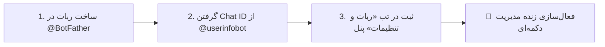
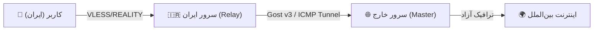

<div align="center">

<p align="center">
  
</p>

# 🛡️ Nyx Panel (نیکس پنل)
### سامانه نسل جدید مدیریت اتصالات Xray-core متمرکز بر شبکه و فیلترینگ ایران
#### 🔐 توسعه داده‌شده توسط تیم امنیتی ساینت (Cynet Security Team)

[](https://github.com/thecynetx/nyx)
[](#-۳-راه‌اندازی-رایگان-روی-سرورهای-ابری-railway--render--docker)
[](https://github.com/thecynetx/nyx)
[](https://t.me/cynetx)
[](https://youtu.be/6Ekgxg-eSx8)
[](https://cynetx.ir)
[](https://github.com/thecynetx/nyx/blob/main/LICENSE)

<p align="center">
  <b>Language Options / تغییر زبان:</b>
  <br />
  <b>🇮🇷 Persian (فارسی)</b> • <a href="README_EN.md">🇺🇸 English</a>
</p>

<p align="center" dir="rtl">
  راهکار سبک، پایدار و ضد فیلتر طراحی‌شده برای شرایط اختلالات شدید، نت ملی و مسدودی SNI
  <br />
  <code>VLESS + REALITY</code> · <code>XHTTP (SplitHTTP)</code> · <code>Packet Fragment</code> · <code>MultiPath Engine</code> · <code>Auto-Failover SNI</code> · <code>Custom Domain / CDN</code> · <code>Cloudflare WARP</code>
</p>

<p align="center">
  <a href="https://youtu.be/6Ekgxg-eSx8" target="_blank">
    
  </a>
  <br />
  <br />
  <a href="https://youtu.be/6Ekgxg-eSx8" target="_blank">
    
  </a>
  <br />
  <br />
  <a href="https://youtu.be/6Ekgxg-eSx8" target="_blank">
    <span dir="rtl">🔴 <b>جهت تماشای ویدیو معرفی و آموزش کامل در یوتیوب کلیک کنید</b> 🔴</span>
  </a>
</p>

[🛡️ نسخه v2.4.4 (Zero-Bug Update)](#-قابلیت‌ها-و-رفع-باگ‌های-حیاتی-در-نسخه-v244-the-zero-bug--resilience-release) •
[🔥 قابلیت‌های نسخه ۲.۴](#-قابلیت‌های-جدید-در-نسخه-v240-the-power--customization-update) •
[📊 مقایسه فنی](#-جدول-مقایسه-فنی-nyx-panel-با-سایر-پنل‌ها-3x-ui-و-مرزبان) •
[💻 نصب سریع](#-راهنمای-نصب-سریع-روی-سرور-لینوکس-و-ویندوز) •
[☁️ راه‌اندازی ابری و داکر](#-۳-راه‌اندازی-رایگان-روی-سرورهای-ابری-railway--render--docker) •
[🧩 مستندات کامل امکانات](#-مستندات-جامع-امکانات-پنل) •
[🤖 ربات تلگرام](#-راهنمای-کامل-پیکربندی-و-استفاده-از-ربات-تلگرام) •
[📱 اتصال کلاینت‌ها](#-راهنمای-استفاده-در-نرم‌افزارهای-کلاینت) •
[🌐 تونل ایران-خارج](#-راهنمای-راه‌اندازی-تونل-انتقال-ترافیک-سرور-ایران-به-خارج) •
[🛠️ دستورات لینوکس](#-دستورات-مدیریت-سرویس-در-لینوکس-systemd-commands) •
[📜 تاریخچه نسخه‌ها](#-تاریخچه-تغییرات-و-نسخه‌های-پیشین-changelog) •
[🗑️ راهنمای حذف](#-راهنمای-حذف-کامل-و-پاکسازی-پنل)

</div>

---

<div dir="rtl">

## 🛡️ قابلیت‌ها و رفع باگ‌های حیاتی در نسخه v2.4.4 (The Zero-Bug & Resilience Release)

> ⭐️ **تشکر و قدردانی ویژه:** با تشکر و سپاس ویژه از همراه گرامی **امیر عزیز (آیدی تلگرام: [@amirnn21](https://t.me/amirnn21))** بابت تست‌های عمیق فنی، شبیه‌سازی شرایط مرزی و گزارش دقیق لاگ‌ها که منجر به شناسایی و حل ریشه‌ای باگ‌های حساس در این نسخه گردید.

### 🐛 ۱. رفع خطای `User already exists` در Xray و تداخل ایمیل‌های کلاینت
* در هسته Xray فیلد `email` کلاینت‌ها باید در سطح هر اینباند کاملاً یونیک باشد. در نسخه‌های قبلی، ایمیل کلاینت خودِ اینباند با مقدار `remark` ست می‌شد که در صورت همنام بودن با نام کاربری یک کاربر یا اضافه شدن اینباند جدید با نام مشابه، Xray با خطای `User already exists` رد می‌شد.
* **راهکار:** افزودن پیشوند ایمن `~` به ایمیل اختصاصی اینباندها (`~remark`) و تعریف ساختار `addedEmails Set` برای جلوگیری قطعی از تکرار ایمیل در هسته Xray.

### 🛡️ ۲. جلوگیری از ایجاد اینباند یا کاربر تکراری (Atomic DB Rollback)
* در صورت بروز هرگونه خطای احتمالی در پروسه راه‌اندازی مجدد Xray (`reloadXrayService`)، رکورد ثبت‌شده فوراً از پایگاه‌داده Rollback و حذف می‌گردد تا در صورت کلیک مجدد کاربر، اینباندهای دوتایی یا سه‌تایی تکراری ایجاد نشوند.

### 🔒 ۳. اصلاح اعمال دسترسی کاربر به اینباندهای مشخص (`inboundIds`)
* رفع باگی که باعث می‌شد پارامتر `inboundIds` در آبجکت ارسال‌شده به `configGenerator` قرار نگیرد؛ اکنون تفکیک دسترسی هر کاربر به اینباندهای مجازش با دقت ۱۰۰٪ در هسته Xray اعمال می‌گردد.

### ⚙️ ۴. حذف دستور مخرب متوقف‌سازی Nginx
* دستور `systemctl stop nginx` از اسکریپت ریلود Xray حذف شد تا تداخلی با پروکسی‌های معکوس و سرویس‌های همجوار سرور ایجاد نگردد. همچنین الگوهای `pkill` هدفمندتر شدند (`pkill -9 -f "xray run"`).

### 📊 ۵. اصلاح راندمان پردازنده و حذف آمارهای فیک
* فرمول محاسبه مصرف CPU تصحیح شد (تقسیم Load Average بر تعداد هسته‌های پردازنده) و مقادیر رندوم آزمایشی پینگ و سرعت حذف شدند.

### ⚡ ۶. ارتقای هوشمند موتور دانلود Xray-core در اسکریپت نصب (`install.sh`)
* اسکریپت نصب به شکل داینامیک آخرین تگ ریلیز رسمی Xray را دریافت نموده و در صورت اختلال شبکه به نسخه امن و پایدار `v25.1.30` سوییچ می‌کند.

### 🚀 ۷. اعمال فوری انقضای حجم و زمان کاربران در هسته Xray
* به محض رسیدن مصرف کاربر به سقف مجاز یا پایان تاریخ اشتراک، علاوه بر تغییر وضعیت در دیتابیس، هسته Xray بلافاصله ریلود شده و دسترسی کاربر بدون تاخیر قطع می‌گردد.

---

<p align="center">
  
</p>

در این آپدیت بزرگ، بر اساس بازخوردها و پیشنهادات کاربران و ادمین‌های عزیز، امکانات شخصی‌سازی پیشرفته، پشتیبانی از دامنه و CDN، پروتکل‌های نسل جدید و برندینگ کامل برای فروشندگان اضافه شده است:

### 🌐 ۱. پشتیبانی کامل از دامنه اختصاصی و CDN کلودفلر (`Custom Domain & CDN Mapping`)
* **اتصال دامنه دلخواه به جای IP سرور:** ادمین می‌تواند در تب تنظیمات، دامنه شخصی یا ساب‌دامین متصل به CDN کلودفلر (مثل `vpn.mydomain.com`) را وارد کند تا در تمام لینک‌های VLESS، سابسکریپشن‌های Base64، سینگ‌باکس و کلش جایگزین IP خام سرور شود.
* **تنظیم دامنه مستقل به ازای هر اینباند:** قابلیت تعیین دامنه یا هاست مجزا برای هر اینباند به صورت کاملاً مستقل جهت تفکیک اپراتورها یا سرورهای لبه.

### ⚡ ۲. تنظیمات دقیق و حرفه‌ای پکت فرگمنت در پنل (`Packet Fragment Tuning`)
* **تنظیم دستی پارامترهای پکت:** بدون نیاز به دستکاری دستی فایل‌های کانفیگ، مقدار طول پکت (`Fragment Length`) و فاصله زمانی ارسال (`Fragment Interval`) مستقیماً از داخل فرم ساخت و ویرایش اینباندها قابل تنظیم است.
* **پریست‌های آماده و بهینه‌سازی‌شده اپراتورها:**
  * 📱 **همراه اول (MCI):** `100-200, 10-20` (بالاترین نرخ پایداری روی نت همراه اول)
  * 📡 **ایرانسل (Irancell):** `50-150, 5-15` (عبور موثر از الگوریتم‌های DPI ایرانسل)
  * ⚡ **ترافیک داخلی / اینترانت:** `10-60, 2-10`

### 🚀 ۳. ترنسپورت نسل جدید `XHTTP (SplitHTTP)`، `gRPC` و پروتکل‌های `Shadowsocks` و `Trojan`
* **پروتکل نوین XHTTP:** جدیدترین نوآوری هسته Xray برای عبور از شدیدترین فیلترینگ‌ها و دور زدن مسدودی وب‌سوکت‌ها روی کلودفلر و سرورهای واسط.
* **پشتیبانی کامل از پروتکل‌ها:** ارائه همزمان `VLESS`, `VMess`, `Trojan` و `Shadowsocks (AEAD & SS-2022)` روی ترنسپورت‌های `TCP Reality`, `WebSocket`, `XHTTP`, `gRPC`.

### 🎨 ۴. شخصی‌سازی کامل صفحه ساب مشتری و برندینگ اختصاصی (`Sub Portal Custom Branding`)
* **برندینگ کامل صفحه مشتری (`/subinfo/:uuid`):** امکان تعریف نام برند یا فروشگاه، قرار دادن آدرس لوگوی اختصاصی و تنظیم هویت بصری صفحه اشتراک خریداران.
* **دکمه‌های مستقیم پشتیبانی و تمدید اشتراک:** اتصال مستقیم دکمه‌های شیک به آیدی تلگرام پشتیبانی و کانال تلگرام جهت تمدید سریع و رفع اشکال کاربران.
* **کادر پیام و اطلاعیه به مشتریان:** درج اعلان‌ها، هشدارها یا راهنمای اتصال مخصوص کاربران در بالای صفحه سابسکریپشن.
* **باکس دانلود ۱-کلیک نرم‌افزارهای کلاینت:** لینک‌های آماده و مستقیم دانلود اپلیکیشن‌های اندروید (v2rayNG)، آیفون (Streisand) و ویندوز (v2rayN).

### 🔍 ۵. جستجو و فیلتر لحظه‌ای کاربران و اینباندها (`Instant Live Search`)
* **نوار سرچ سریع کاربران:** فیلتر آنی کاربران بر اساس نام کاربری، شناسه UUID یا وضعیت فعال/منقضی.
* **نوار سرچ سریع اینباندها:** جستجوی فوری بر اساس نام کانفیگ، پورت، پروتکل، SNI یا دامنه.

### 📱 ۶. طراحی کاملاً لمسی و بهینه‌سازی‌شده برای موبایل (`Mobile-First UX`)
* بازطراحی و روان‌سازی تمام کارت‌ها، مودال‌ها، اسلایدرها و منوهای پنل جهت استفاده بسیار سریع روی انواع گوشی‌های هوشمند و تبلت‌ها.

---

## 📊 جدول مقایسه فنی Nyx Panel با سایر پنل‌ها (3x-ui و مرزبان)

<p align="center">
  
</p>

</div>

<div dir="ltr" align="center">

| Feature / Capability | 🛡️ Nyx Panel v2.4 | 3x-ui (Sanaei) | Marzban |
|---|:---:|:---:|:---:|
| **☁️ 1-Click Cloud Deploy (Railway/Codespaces/Docker)** | **Yes (100% Free & No Credit Card)** | No | No |
| **⚛️ Quantum MultiPath 4-Route Engine** | **Yes (4 Live Parallel Paths)** | No | No |
| **⚖️ Smart Health Load Balancer for Subscriptions** | **Yes (Auto-ranks healthiest server #1)** | No | No |
| **🚨 Panic Mode Blackout Detection & Alert** | **Yes (Auto Telegram Notification)** | No | No |
| **🌐 Custom Domain & Cloudflare CDN Mapping** | **Yes (Global + Per-Inbound)** | Basic | Basic |
| **⚡ Packet Fragment Custom Tuning & Presets** | **Yes (MCI, Irancell, Intranet Presets)** | Limited | Limited |
| **🚀 Next-Gen XHTTP (SplitHTTP) & gRPC** | **Yes (Full Protocol Suite)** | Basic | Basic |
| **🔑 Protocols: VLESS + VMess + Trojan + Shadowsocks** | **Yes (Full Suite + SS-2022)** | Yes | Yes |
| **🎨 Subscriber Portal Branding & Support Links** | **Yes (Logo, Support, App Downloads)** | No | Limited |
| **Cross-Platform (Linux + Windows Server)** | **Yes (Native PowerShell + Bash)** | Linux Only | Linux Only |
| **RAM Footprint (Memory)** | **Lightweight (~70 MB)** | Moderate (~250 MB) | Heavy (~400 MB+) |
| **Automated Telegram DB Backup & 1-Click Restore** | **Yes (Auto 24h & Telegram Upload)** | Complex Manual | Manual Script |
| **Smart Auto-Failover SNI Daemon** | **Yes (DPI Blackout Auto-Switch)** | No | No |
| **1-Click Cloudflare WARP Outbound** | **Yes (Anti-Sanction & IP Shield)** | Complex Manual | Complex Manual |
| **100% Button-driven Telegram Bot** | **Yes (Step-by-step Wizard)** | Limited | Command-based |
| **Standalone User Web Page** | **Yes (`/subinfo/:uuid`)** | No | Basic |
| **Intranet Tunnel Generator** | **Yes (Gost v3 / ICMP / DNS)** | No | No |
| **VLESS + REALITY Support** | **Yes (X25519 Keypair)** | Yes | Yes |

</div>

<div dir="rtl">

---

## 💻 راهنمای نصب سریع روی سرور لینوکس و ویندوز

### 🐧 ۱. نصب روی سرور لینوکس (`Ubuntu / Debian / CentOS / AlmaLinux`):
دستور زیر را با دسترسی **root** در ترمینال لینوکس اجرا کنید:

</div>

<div dir="ltr">

```bash
bash <(curl -Ls https://raw.githubusercontent.com/thecynetx/nyx/main/install.sh)
```

</div>

<div dir="rtl">

---

### 🪟 ۲. نصب روی سرور ویندوز (`Windows Server 2016-2022 / Windows 10/11`):
ترمینال **PowerShell** را به صورت **Run as Administrator** باز کرده و دستور زیر را اجرا کنید:

</div>

<div dir="ltr">

```powershell
iwr -useb https://raw.githubusercontent.com/thecynetx/nyx/main/install.ps1 | iex
```

</div>

<div dir="rtl">

---

### ☁️ ۳. راه‌اندازی رایگان روی سرورهای ابری (`GitHub Codespaces / Railway / Docker`):

اگر سرور مجازی (`VPS`) ندارید، می‌توانید پنل Nyx را بدون ۱ ریال هزینه روی **GitHub Codespaces** یا **Railway** راه‌اندازی کنید:

#### ⚡ راهنمای راه‌اندازی ۱-کلیکه روی GitHub Codespaces (کاملاً رایگان):
1. وارد اکانت گیت‌هاب خود شده و در همین ریپازیتوری روی دکمه سبز **`Code`** و سپس تب **`Codespaces`** کلیک کنید و **`Create codespace on main`** را بزنید.
2. در تب **Terminal** پایین صفحه، دستور زیر را پیست کرده و اینتر بزنید:
```bash
bash -c "$(curl -fsSL https://raw.githubusercontent.com/thecynetx/nyx/main/install.sh)"
```
3. در تب **PORTS** (کنار Terminal)، روی پورت **3080** راست‌کلیک کرده و **Port Visibility** را روی **Public** قرار دهید.
4. روی آیکون مرورگر (کره زمین) کلیک کنید تا وارد پنل شوید (یوزر: `admin` و پسورد: `admin123`).

#### 🚀 مراحل راه‌اندازی روی Railway:
1. وارد سایت [railway.com](https://railway.com) شده و با اکانت گیت‌هاب لاگین کنید.
2. روی دکمه **`+ New Project`** کلیک کرده و گزینه **`Deploy from GitHub repo`** را بزنید.
3. نام مخزن `thecynetx/nyx` را انتخاب کرده و روی **`Deploy Now`** کلیک کنید.
4. پس از چند ثانیه، وارد تب **Settings** شده و در بخش **Networking** روی **Generate Domain** بزنید تا آدرس امن دامنه رایگان (HTTPS) به شما داده شود.
5. آدرس دامنه را در مرورگر باز کرده و با نام کاربری `admin` و رمز `admin123` وارد پنل شوید!

#### 🐳 اجرای با Docker و Docker Compose:

</div>

<div dir="ltr">

```bash
# اجرا با داکر کامپوز
docker-compose up -d

# یا اجرای مستقیم کانتینر
docker run -d \
  --name nyx-panel \
  -p 3080:3080 \
  -p 443:443 \
  -v nyx_data:/data \
  --restart unless-stopped \
  ghcr.io/thecynetx/nyx:latest
```

</div>

<div dir="rtl">

---

## 🧩 مستندات جامع امکانات پنل

### ⚛️ ۱. موتور مسیریابی ۴ مسیره (`Quantum MultiPath Engine`)
موتور پایش موازی که در شرایط اختلال شدید اینترنت ایران، ۴ مسیر ارتباطی مستقل را به صورت همزمان بررسی و پایش می‌کند:
```text
🛡️ Route 1 (Standard):    Direct VLESS + REALITY ──► Free Internet ✅
☁️ Route 2 (DPI Blocked): Domestic Iran CDN (ArvanCloud PoP) ──► Server ──► Internet ✅
🌐 Route 3 (Heavy Cut):   DNS Tunnel via Port 53 ──► Internet ✅  
📡 Route 4 (Emergency):   L3 ICMP Ping Tunnel ──► Internet ✅
```
* **پایش موازی در هر ۱۵ ثانیه:** بررسی خودکار و بدون تداخل تمام مسیرها با `Promise.allSettled`.
* **🚨 سیستم مدیریت بحران (Panic Mode):** در صورت قطعی کامل بین‌الملل، هشدار فوری به تلگرام ادمین ارسال شده و پس از برقراری مجدد اتصال، مدت زمان دقیق قطعی گزارش داده می‌شود.

### ⚖️ ۲. لودبالانسر هوشمند سابسکریپشن (`Smart Health Load Balancer`)
* تمام اینباندهای فعال هر ۳۰ ثانیه بر اساس تاخیر زمانی (`Ping`)، پایداری و نرخ آپتایم نمره‌دهی (۰ تا ۱۰۰) می‌شوند.
* هنگام آپدیت لینک سابسکریپشن، پایدارترین و پرسرعت‌ترین سرور همیشه به صورت خودکار در بالاترین ردیف لینک‌های کاربر قرار می‌گیرد.

### 🛡️ ۳. سامانه سوئیچ خودکار دامنه (`Smart Auto-Failover SNI Daemon`)
* پایش دائم و زنده وضعیت هندشیک TLS اینباندها در هر ۶۰ ثانیه.
* در صورت فیلتر شدن یک دامنه توسط اپراتورها، سیستم به صورت خودکار و بدون نیاز به دستکاری ادمین، سالم‌ترین دامنه لیست سفید را جایگزین می‌کند؛ **لینک سابسکریپشن کاربران بدون نیاز به تغییر متصل می‌ماند!**

### 🌐 ۴. خروجی کلودفلر WARP و رفع تحریم (`Cloudflare WARP Outbound`)
* دریافت خودکار اکانت و کلیدهای وایرگارد از API رسمی کلودفلر با ۱ کلیک.
* رفع تحریم کامل سرویس‌های هوش مصنوعی (`ChatGPT`, `OpenAI`)، `Spotify`، `Netflix` و مخفی‌سازی کامل IP سرور اصلی.

### 💾 ۵. بکاپ‌گیری خودکار دیتابیس در تلگرام و بازیابی در ۳ ثانیه
* ارسال خودکار و رمزشده فایل کامل دیتابیس SQLite به تلگرام ادمین در بازه‌های ۲۴ ساعته.
* امکان بازیابی فوری در سرور جدید تنها با ارسال مجدد فایل بکاپ به ربات تلگرام.

### 🤖 ۶. ربات تلگرام ادمین (۱۰۰٪ دکمه‌ای)
* ساخت کاربر جدید مرحله‌به‌مرحله با دکمه‌های شیشه‌ای بدون نیاز به تایپ دستورات متنی.
* دریافت فوری لینک سابسکریپشن، تغییر حجم، تمدید زمان و مشاهده آمار مصرف.

### 🌐 ۷. اسکریپت‌ساز هوشمند تونل سرور ایران به خارج
* تولید خودکار اسکریپت‌های نصب و اجرای سرویس‌های تونل‌زنی (`Gost v3`, `Rathole`, `PingTunnel`, `DNS Tunnel`, `IPTables`) برای دور زدن فیلترینگ ملی.

---

## 🤖 راهنمای کامل پیکربندی و استفاده از ربات تلگرام



1. وارد تب **«ربات و تنظیمات»** در داشبورد وب پنل شوید.
2. توکن دریافت شده از [@BotFather](https://t.me/BotFather) را در بخش **Bot Token** وارد کنید.
3. چت‌آیدی عددی تلگرام خود را (از ربات [@userinfobot](https://t.me/userinfobot)) در بخش **Admin Chat ID** وارد کرده و دکمه **«ذخیره و شروع ربات»** را بزنید.
4. با استارت کردن ربات در تلگرام، منوی دکمه‌ای مدیریت برایتان فعال می‌شود!

---

## 📱 راهنمای استفاده در نرم‌افزارهای کلاینت

</div>

<div dir="ltr" align="center">

| Client Application | Platform | Supported Formats | How to Connect |
|---|---|---|---|
| **v2rayNG** | Android | Base64 Sub / VLESS Link | Import from Clipboard / Scan QR |
| **Streisand** | iOS (iPhone / iPad) | VLESS / Subscription URL | Scan QR Code or Paste Link |
| **Sing-Box** | Android / iOS / Windows | Remote Sub URL / JSON | Add Subscription / Remote Link |
| **V2rayN** | Windows | VLESS Link / Sub URL | `Ctrl+V` or Add Subscription |
| **MahsaNG** | Android | VLESS Link / Sub Link | Copy link and tap + |
| **Shadowrocket** | iOS (iPhone / iPad) | VLESS / QR Code / Sub | Scan QR Code or Paste Link |
| **Hiddify** | All Platforms | Subscription URL | Paste Subscription Link |
| **Clash Meta / Stash** | Windows / macOS / iOS | YAML File / Remote Sub | Import YAML or Remote Sub |

</div>

<div dir="rtl">

---

## 🌐 راهنمای راه‌اندازی تونل انتقال ترافیک (سرور ایران به خارج)

در صورت اختلال شدید در ارتباط مستقیم، ترافیک کاربران ابتدا به سرور واسط ایران هدایت شده و از طریق تونل امن به سرور خارج منتقل می‌شود:



1. وارد تب **«تونل قطعی نت»** در وب‌داشبورد شوید.
2. **آدرس IP سرور ایران** و **آدرس IP سرور خارج** را وارد کنید.
3. پروتکل تونل دلخواه (مانند `Gost v3` یا `ICMP`) را انتخاب کرده و دکمه **«تولید اسکریپت و راهنمای نصب»** را بزنید.
4. اسکریپت‌ها را در سرورهای مربوطه اجرا کنید؛ سرویس‌ها به صورت خودکار با Systemd تنظیم و فعال می‌شوند.

---

## 🛠️ دستورات مدیریت سرویس در لینوکس (`Systemd Commands`)

- **مشاهده وضعیت سرویس:** `systemctl status nyx`
- **راه‌اندازی مجدد سرویس (Restart):** `systemctl restart nyx`
- **مشاهده لاگ‌های زنده سیستم:** `journalctl -u nyx -f`
- **توقف سرویس:** `systemctl stop nyx`

---

## 📜 تاریخچه تغییرات و نسخه‌های پیشین (`Changelog`)

<details>
<summary><b>📦 مشاهده خلاصه تغییرات نسخه‌های پیشین (v2.1 تا v2.3)</b></summary>
<br />

* **نسخه v2.3.0:** اضافه شدن موتور ۴ مسیره Quantum MultiPath Engine، لودبالانسر هوشمند سابسکریپشن، سیستم Panic Mode و بازطراحی مدرن رابط کاربری (Soft Glassmorphism).
* **نسخه v2.2.0:** بکاپ‌گیری خودکار دیتابیس به تلگرام با بازیابی ۳ ثانیه‌ای، سامانه سوئیچ خودکار SNI در زمان مسدودی، و خروجی کلودفلر WARP جهت رفع تحریم ChatGPT.
* **نسخه v2.1.0:** اسکریپت‌ساز هوشمند تونل‌های داخلی به خارج (Gost, Rathole, ICMP, DNS) و پشتیبانی نیتیو از ویندوز سرور.
* **نسخه v2.0.0:** پروتکل VLESS Reality با کلیدهای اختصاصی X25519 و ربات تلگرام ادمین ۱۰۰٪ دکمه‌ای.

</details>

---

## 🗑️ راهنمای حذف کامل و پاکسازی پنل

### 🐧 ۱. حذف کامل روی سرور لینوکس (`Linux`):
```bash
curl -sSL "https://raw.githubusercontent.com/thecynetx/nyx/main/uninstall.sh" | sudo bash
```

### 🪟 ۲. حذف کامل روی ویندوز سرور (`Windows Server`):
```powershell
Unregister-ScheduledTask -TaskName "NyxPanelService" -Confirm:$false -ErrorAction SilentlyContinue
Get-Process -Name "node", "xray" -ErrorAction SilentlyContinue | Stop-Process -Force
Remove-Item -Path "C:\Nyx" -Recurse -Force -ErrorAction SilentlyContinue
```

---

## 📢 تیم توسعه و شبکه اجتماعی ساینت (Cynet Security Team)

پروژه **Nyx Panel** به صورت متن‌باز توسط **تیم امنیتی ساینت (Cynet)** توسعه داده شده است. 

> ⭐️ با **ستاره دادن (Star ⭐️) به این مخزن** ما را در توسعه مداوم و ارائه آپدیت‌های جدید همراهی کنید!

- 📢 **کانال تلگرام پشتیبانی و گزارش باگ:** [t.me/cynetx](https://t.me/cynetx)
- 🎥 **کانال یوتیوب:** [youtube.com/@cynetxir](https://www.youtube.com/@cynetxir)
- 🌐 **وب‌سایت رسمی:** [cynetx.ir](https://cynetx.ir)

---

## 📄 لایسنس
این پروژه به صورت متن‌باز تحت لایسنس **MIT** منتشر شده است.

</div>
