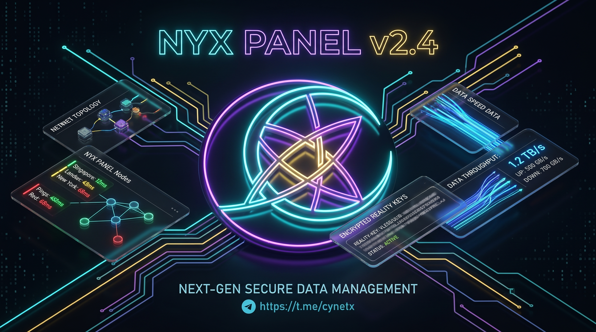
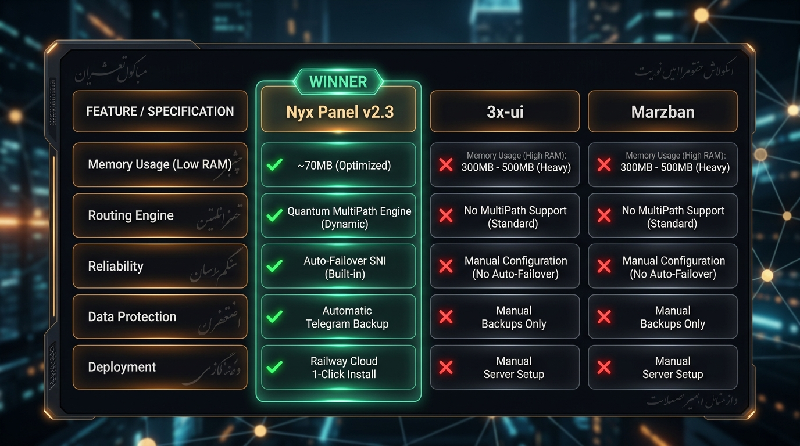
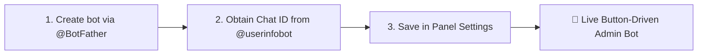
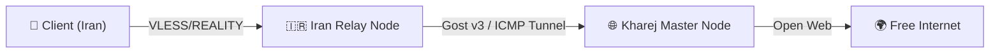

<div align="center">

<p align="center">
  
</p>

# 🛡️ Nyx Panel
### Next-Gen Xray-core Management Panel Tailored for High-Restricted Networks
#### 🔐 Developed by Cynet Security Team

[](https://github.com/thecynetx/nyx)
[](https://github.com/XTLS/Xray-core)
[](https://github.com/thecynetx/nyx)
[](https://github.com/thecynetx/nyx)
[](https://t.me/cynetx)
[](https://www.youtube.com/@cynetxir)
[](https://github.com/thecynetx/nyx/blob/main/LICENSE)

<p align="center">
  <b>Language Options:</b>
  <br />
  <a href="README.md">🇮🇷 Persian (فارسی)</a> • <b>🇺🇸 English</b>
</p>

<p align="center">
  Lightweight, stable, and censorship-resilient Xray management panel designed for DPI blackouts and SNI filtering
  <br />
  <code>VLESS + REALITY</code> · <code>XHTTP (SplitHTTP)</code> · <code>Packet Fragment</code> · <code>MultiPath Engine</code> · <code>Auto-Failover SNI</code> · <code>Custom Domain / CDN</code> · <code>Cloudflare WARP</code>
</p>

<p align="center">
  <a href="https://youtu.be/6Ekgxg-eSx8" target="_blank">
    
  </a>
  <br />
  <br />
  <a href="https://youtu.be/6Ekgxg-eSx8" target="_blank">
    
  </a>
</p>

[🛡️ Version 2.4.2](#-whats-new-in-version-242-the-hardening--zero-crash-release) •
[🔥 Version 2.4 Features](#-whats-new-in-version-240-the-power--customization-update) •
[📊 Comparison Table](#-feature-comparison-table-nyx-panel-vs-3x-ui--marzban) •
[💻 Quick Install](#-quick-installation-guide-linux--windows) •
[☁️ Cloud PaaS & Docker](#-3-free-cloud-paas-deployment-railway--render--docker) •
[🧩 Detailed Documentation](#-detailed-feature-documentation) •
[🤖 Telegram Bot Guide](#-telegram-bot-configuration--usage-guide) •
[📱 Client Apps](#-client-application-setup-guide) •
[🌐 Tunnel Relay Guide](#-intranet-tunnel-relay-guide-iran-to-kharej) •
[🛠️ Systemd Commands](#-service-management-commands-linux) •
[📜 Changelog](#-changelog--version-history) •
[🗑️ Uninstallation](#-uninstallation-guide)

</div>

---

## 🛡️ What's New in Version 2.4.2 (The Hardening & Zero-Crash Release)

> ⭐️ **Special Recognition:** Special thanks to **Amir (Telegram: [@amirnn21](https://t.me/amirnn21))** for comprehensive technical reporting, edge-case log analysis, and architectural recommendations that significantly boosted the panel's resilience and stability.

### ⚡ 1. Atomic Xray Config Testing (`xray -test`) & Instant Snapshot Rollback
* Eliminates Xray core crashes caused by invalid inbound configurations. Candidate configs are pre-validated before applying; if validation fails, the active config continues running without a single second of service downtime.
* Automatic configuration snapshots (`config.backup.json`) are preserved before every successful change with instant 1-click rollback.

### 🩺 2. Genuine Socket/Port Health Monitoring
* The Load Balancer now verifies genuine local TCP socket binding (`127.0.0.1:port`) directly on the Xray process, preventing false "3/3 Healthy" status if Xray ever crashes.

### 🛡️ 3. Compatibility Matrix Validator
* Proactively prevents incompatible protocol configurations (e.g. WebSocket + REALITY) in both the frontend modal and backend generator.

### 👥 4. Granular User-to-Inbound Assignment (Many-to-Many)
* Assign specific users to designated inbounds, ensuring subscription links deliver only authorized server nodes.

### 🚀 5. Xray-core Modern Engine Upgrade (v25+)
* Upgraded to the latest official Xray binary release with full support for modern WebSocket enhancements and high-throughput SplitHTTP/XHTTP transports.

---

<p align="center">
  
</p>

This major release introduces powerful customization, custom domain & CDN mapping, next-gen XHTTP transports, and subscriber web portal branding based on community feedback:

### 🌐 1. Custom Server Domain & Cloudflare CDN Mapping (`Custom Domain`)
* **Eliminate Raw Server IP:** Set a custom domain or Cloudflare CDN subdomain (e.g. `vpn.mydomain.com`) in Settings. The system automatically replaces the raw VPS IP across all generated VLESS links, Base64 subscriptions, Sing-Box JSON, and Clash YAML configurations.
* **Per-Inbound Domain Overrides:** Support independent custom domains per inbound config to accommodate multiple edge nodes or carrier-specific domains.

### ⚡ 2. Advanced Packet Fragment UI Customization & Presets
* **Manual Packet Tuning:** Directly adjust `Fragment Length` (e.g. `100-200`) and `Fragment Interval` (e.g. `10-20`) in Inbound modals without manual JSON file edits.
* **Operator-Optimized Presets:**
  * 📱 **MCI (Hamrah Aval):** `100-200, 10-20` (Highest connection stability)
  * 📡 **Irancell:** `50-150, 5-15` (Effective against aggressive DPI throttling)
  * ⚡ **Intranet / Low Latency:** `10-60, 2-10`

### 🚀 3. Next-Gen `XHTTP (SplitHTTP)`, `gRPC`, and `Trojan` Support
* **XHTTP Transport:** Xray's latest anti-censorship standard specifically engineered for harsh DPI censorship and CDN multiplexing.
* **Full Protocol Suite:** Comprehensive support for `VLESS`, `VMess`, and `Trojan` across `TCP Reality`, `WebSocket`, `XHTTP`, and `gRPC`.

### 🎨 4. Subscriber Web Portal Custom Branding (`/subinfo/:uuid`)
* **Brand Name & Custom Logo:** Set your business name and custom logo URL to give customers a fully branded web portal experience.
* **Direct Telegram Support & Channel Links:** 1-click contact buttons for user renewals, customer support, and announcements.
* **Customer Notice Box:** Prominent announcement banner for service notices and operator instructions.
* **1-Click Client App Downloads:** Direct download cards for Android (v2rayNG), iOS (Streisand), and Windows (v2rayN).

### 🔍 5. Instant Live Search & Filtering
* **Live Search for Users:** Instant filtering by username, UUID, or active/expired status.
* **Live Search for Inbounds:** Filter by inbound name, port, protocol, SNI, or custom domain.

### 📱 6. Mobile-First Touch-Friendly UX
* Responsive luxury glassmorphism UI optimized for smartphones, tablets, and desktop displays.

---

## 📊 Feature Comparison Table (Nyx Panel vs 3x-ui & Marzban)

<p align="center">
  
</p>

<div align="center">

| Feature / Capability | 🛡️ Nyx Panel v2.4 | 3x-ui (Sanaei) | Marzban |
|---|:---:|:---:|:---:|
| **⚛️ Quantum MultiPath 4-Route Engine** | **Yes (4 Live Parallel Paths)** | No | No |
| **⚖️ Smart Health Load Balancer for Subscriptions** | **Yes (Auto-ranks healthiest server #1)** | No | No |
| **🚨 Panic Mode Blackout Detection & Alert** | **Yes (Auto Telegram Notification)** | No | No |
| **🌐 Custom Domain & Cloudflare CDN Mapping** | **Yes (Global + Per-Inbound)** | Basic | Basic |
| **⚡ Packet Fragment Custom Tuning & Presets** | **Yes (MCI, Irancell, Intranet Presets)** | Limited | Limited |
| **🚀 Next-Gen XHTTP (SplitHTTP) & gRPC** | **Yes (Full Protocol Suite)** | Basic | Basic |
| **🎨 Subscriber Portal Branding & Support Links** | **Yes (Logo, Support, App Downloads)** | No | Limited |
| **Cross-Platform (Linux + Windows Server)** | **Yes (Native PowerShell + Bash)** | Linux Only | Linux Only |
| **RAM Footprint (Memory)** | **Lightweight (~70 MB)** | Moderate (~250 MB) | Heavy (~400 MB+) |
| **Automated Telegram DB Backup & 1-Click Restore** | **Yes (Auto 24h & Telegram Upload)** | Complex Manual | Manual Script |
| **Smart Auto-Failover SNI Daemon** | **Yes (DPI Blackout Auto-Switch)** | No | No |
| **1-Click Cloudflare WARP Outbound** | **Yes (Anti-Sanction & IP Shield)** | Complex Manual | Complex Manual |
| **100% Button-driven Telegram Bot** | **Yes (Step-by-step Wizard)** | Limited | Command-based |
| **Standalone User Web Page** | **Yes (`/subinfo/:uuid`)** | No | Basic |
| **Intranet Tunnel Generator** | **Yes (Gost v3 / ICMP / DNS)** | No | No |
| **VLESS + REALITY Support** | **Yes (X25519 Keypair)** | Yes | Yes |

</div>

---

## 💻 Quick Installation Guide (Linux & Windows)

### 🐧 1. Linux Installation (`Ubuntu / Debian / CentOS / AlmaLinux`):
Run the following one-line command as **root**:

```bash
bash <(curl -Ls https://raw.githubusercontent.com/thecynetx/nyx/main/install.sh)
```

---

### 🪟 2. Windows Server Installation (`Windows Server 2016-2022 / Windows 10/11`):
Open **PowerShell** as **Administrator** and run:

```powershell
iwr -useb https://raw.githubusercontent.com/thecynetx/nyx/main/install.ps1 | iex
```

---

### ☁️ 3. Free Cloud PaaS Deployment (`Railway / Render / Docker`):

If you don't own a VPS, you can host Nyx Panel on free cloud platforms such as **Railway.app**:

#### 🚀 Deploy to Railway in 1 Minute:
1. Log in to [railway.com](https://railway.com) using your GitHub account.
2. Click **`+ New Project`** ➔ **`Deploy from GitHub repo`**.
3. Select `thecynetx/nyx` and click **`Deploy Now`**.
4. Once active, go to **Settings** ➔ **Networking** ➔ click **Generate Domain** to get a free HTTPS domain.
5. Open your domain, log in with `admin` / `nyx2026!`, and access your subscriptions!

#### 🐳 Docker & Docker Compose:

```bash
# Run with Docker Compose
docker-compose up -d

# Or run directly with Docker
docker run -d \
  --name nyx-panel \
  -p 3080:3080 \
  -p 443:443 \
  -v nyx_data:/data \
  --restart unless-stopped \
  ghcr.io/thecynetx/nyx:latest
```

---

## 🧩 Detailed Feature Documentation

### ⚛️ 1. Quantum MultiPath 4-Route Parallel Engine
Monitors 4 distinct connection routes simultaneously during severe ISP censorship:
```text
🛡️ Route 1 (Standard):    Direct VLESS + REALITY ──► Free Internet ✅
☁️ Route 2 (DPI Blocked): Domestic Iran CDN (ArvanCloud PoP) ──► Server ──► Internet ✅
🌐 Route 3 (Heavy Cut):   DNS Tunnel via Port 53 ──► Internet ✅  
📡 Route 4 (Emergency):   L3 ICMP Ping Tunnel ──► Internet ✅
```
* **15-Second Parallel Health Benchmarking:** Continuously checks 4 distinct routing layers concurrently via `Promise.allSettled`.
* **🚨 Panic Mode Blackout Response:** Dispatches instant emergency notifications to the admin Telegram bot during complete blackouts, followed by exact outage duration reports upon recovery.

### ⚖️ 2. Health-Scored Smart Subscription Load Balancer
* All active inbounds receive real-time 0–100 health scores computed from TLS handshake latency, rolling uptime, and historical stability.
* Top-performing servers are dynamically ranked at the top of client subscriptions upon refresh.

### 🛡️ 3. Smart Auto-Failover SNI Daemon
* Continuous background TLS handshake auditing every 60s.
* Automatically replaces blocked domains with healthy whitelist domains during DPI crackdowns without changing user subscription links.

### 🌐 4. Cloudflare WARP Outbound & Anti-Sanction Unblocker
* 1-click WireGuard tunnel provisioning via official Cloudflare API.
* Unblocks AI and streaming services (`ChatGPT`, `OpenAI`, `Spotify`, `Netflix`) while hiding the VPS server IP.

### 💾 5. Automated Telegram DB Backup & 3-Second Restore
* Automatic 24-hour encrypted SQLite database backup sent directly to the admin Telegram chat.
* 1-click database restoration by re-uploading the `.db` file to the Telegram bot.

### 🤖 6. 100% Button-Driven Telegram Admin Bot
* Step-by-step interactive wizard for creating subscribers (traffic limits, expiration days).
* User management, subscription link distribution, and instant database backups via inline buttons.

### 🌐 7. Intranet Tunnel Script Generator (Iran Relay to Kharej Master)
* Auto-generates deploy scripts for `Gost v3`, `Rathole`, `PingTunnel (ICMP)`, `DNS Tunnel`, and `IPTables NAT`.

---

## 🤖 Telegram Bot Configuration & Usage Guide



1. Navigate to the **Settings** tab in the Web Dashboard.
2. Enter your Telegram bot token obtained from [@BotFather](https://t.me/BotFather).
3. Enter your numerical Telegram Chat ID from [@userinfobot](https://t.me/userinfobot) and click **Save Settings**.
4. Start your bot in Telegram to access the full admin menu!

---

## 📱 Client Application Setup Guide

<div align="center">

| Client Application | Platform | Supported Formats | How to Connect |
|---|---|---|---|
| **v2rayNG** | Android | Base64 Sub / VLESS Link | Import from Clipboard / Scan QR |
| **Streisand** | iOS (iPhone / iPad) | VLESS / Subscription URL | Scan QR Code or Paste Link |
| **Sing-Box** | Android / iOS / Windows | Remote Sub URL / JSON | Add Subscription / Remote Link |
| **V2rayN** | Windows | VLESS Link / Sub URL | `Ctrl+V` or Add Subscription |
| **MahsaNG** | Android | VLESS Link / Sub Link | Copy link and tap + |
| **Shadowrocket** | iOS (iPhone / iPad) | VLESS / QR Code / Sub | Scan QR Code or Paste Link |
| **Hiddify** | All Platforms | Subscription URL | Paste Subscription Link |
| **Clash Meta / Stash** | Windows / macOS / iOS | YAML File / Remote Sub | Import YAML or Remote Sub |

</div>

---

## 🌐 Intranet Tunnel Relay Guide (Iran to Kharej)

When direct international connections are severely degraded, traffic is relayed through an encrypted tunnel from an Iran server to the foreign Master node:



1. Open the **Tunnels** tab in the Web Dashboard.
2. Input your **Iran Server IP** and **Kharej Server IP**.
3. Select your desired tunnel architecture (`Gost v3`, `ICMP`, etc.) and click **Generate Scripts**.
4. Copy and run the generated scripts on both servers. Systemd services configure and start automatically.

---

## 🛠️ Service Management Commands (Linux)

- **Check Service Status:** `systemctl status nyx`
- **Restart Service:** `systemctl restart nyx`
- **View Live Logs:** `journalctl -u nyx -f`
- **Stop Service:** `systemctl stop nyx`

---

## 📜 Changelog & Version History

<details>
<summary><b>📦 View Previous Version Summaries (v2.0 to v2.3)</b></summary>
<br />

* **Version 2.3.0:** Introduced Quantum MultiPath 4-Route parallel engine, Smart Health Load Balancer, Panic Mode blackout detection, and luxury soft glassmorphism UI redesign.
* **Version 2.2.0:** Automated 24h Telegram SQLite database backup with 3-second restore, Smart Auto-Failover SNI daemon, and Cloudflare WARP anti-sanction outbound.
* **Version 2.1.0:** Smart Intranet tunnel generator (Gost, Rathole, ICMP, DNS) and native Windows Server support.
* **Version 2.0.0:** VLESS Reality with X25519 keypair automation and 100% button-driven Telegram bot.

</details>

---

## 🗑️ Uninstallation Guide

### 🐧 1. Linux Uninstallation:
```bash
curl -sSL "https://raw.githubusercontent.com/thecynetx/nyx/main/uninstall.sh" | sudo bash
```

### 🪟 2. Windows Server Uninstallation:
```powershell
Unregister-ScheduledTask -TaskName "NyxPanelService" -Confirm:$false -ErrorAction SilentlyContinue
Get-Process -Name "node", "xray" -ErrorAction SilentlyContinue | Stop-Process -Force
Remove-Item -Path "C:\Nyx" -Recurse -Force -ErrorAction SilentlyContinue
```

---

## 📢 Cynet Security Team & Community

**Nyx Panel** is developed as an open-source project by **Cynet Security Team**.

> ⭐️ **Star this repository** on GitHub to support ongoing development and rapid updates!

- 📢 **Telegram Channel & Support:** [t.me/cynetx](https://t.me/cynetx)
- 🎥 **YouTube Channel:** [youtube.com/@cynetxir](https://www.youtube.com/@cynetxir)
- 🌐 **Official Website:** [cynetx.ir](https://cynetx.ir)

---

## 📄 License
This project is open-source software licensed under the **MIT License**.
