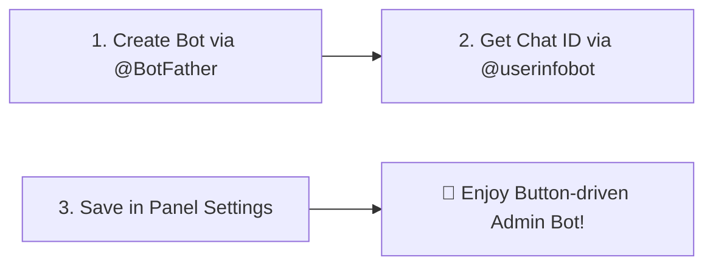
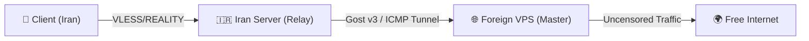

<div align="center">

<p align="center">
  
</p>

# 🛡️ Nyx Panel
### Advanced Anti-Censorship Xray-core Management Panel Tailored for High-Restricted Networks
#### 🔐 Developed by Cynet Security Team

[](https://github.com/icynetx/Nyx)
[](https://t.me/cynetx)
[](https://youtu.be/pFEeQrtCg14)
[](https://cynetx.ir)
[](https://github.com/icynetx/Nyx/blob/main/LICENSE)

<p align="center">
  <b>Language Options:</b>
  <br />
  <a href="README.md">🇮🇷 Persian (فارسی)</a> • <b>🇺🇸 English</b>
</p>

<p align="center">
  Designed for dynamic DPI network blackouts, active SNI filtering, and cross-border intranet traffic relay
  <br />
  <code>VLESS + REALITY (X25519)</code> · <code>Packet Fragment</code> · <code>Auto-Failover SNI</code> · <code>Cloudflare WARP</code> · <code>Auto DB Backup</code>
</p>

<p align="center">
  <a href="https://youtu.be/pFEeQrtCg14" target="_blank">
    
  </a>
  <br />
  <br />
  <a href="https://youtu.be/pFEeQrtCg14" target="_blank">
    
  </a>
</p>

[⚡ Quick Installation](#-quick-installation-guide-linux--windows) •
[🚀 What's New in v2.2](#-whats-new-in-version-220-release-highlights) •
[📊 Comparison Table](#-feature-comparison-table) •
[🧩 Detailed Features](#-detailed-feature-breakdown) •
[🤖 Telegram Bot Guide](#-telegram-bot-configuration--usage-guide) •
[📱 Client Apps](#-client-application-setup-guide) •
[🗑️ Uninstallation](#-uninstallation-guide)

</div>

---

## 🚀 What's New in Version 2.2.0 (Release Highlights)

> [!TIP]
> ### 📦 1. Automated Database Backup & 1-Click Instant Restore (Auto DB Backup & Restore)
> * **24-Hour Automated Backup:** The intelligent background daemon creates encrypted, point-in-time SQLite database backups (`.db`) complete with SHA-256 integrity checksums and automatically dispatches them directly to the **Admin's Telegram Chat**.
> * **3-Second 1-Click Server Migration:** Server crashed or bought a new VPS? Simply forward or upload the `.db` backup file to your Telegram Bot. The panel restores all 100+ users, quotas, expiry dates, and inbounds in **under 3 seconds**!

> [!IMPORTANT]
> ### 🛡️ 2. Smart Dynamic Anti-Blackout Auto-Failover SNI Daemon (Smart Auto-Failover)
> * **Live Background Daemon:** Continuously monitors TLS 1.3 handshakes on port 443 across all active inbounds every 60 seconds.
> * **Automatic DPI Blackout Detection:** Instantly detects when active SNI domains are blocked by ISP DPI filters.
> * **Zero Link Change Fallback:** Seamlessly switches blocked SNIs to the healthiest Whitelist domain (e.g. `ebanking.banksepah.ir` or `arvancloud.ir`) and reloads Xray core. **User subscription links remain 100% operational without needing updates!**

> [!NOTE]
> ### 🌐 3. 1-Click Cloudflare WARP Outbound & IP Shielding (Anti-Sanction & IP Mask)
> * **Automatic Cloudflare WireGuard Account Registration:** Direct API registration for dedicated Cloudflare IPv4 & IPv6 credentials.
> * **Unlocks Sanctioned Services:** Bypasses region locks for `ChatGPT`, `OpenAI`, `Netflix`, `Spotify`, and IP check sites automatically.
> * **VPS IP Masking:** Routes server outbound traffic through Cloudflare WireGuard mesh, keeping your origin VPS IP hidden from ISP blocklists.

<br />

<p align="center">
  
  <br />
  <i>Nyx Panel Control Center: Cloudflare WARP Outbound & Database Backup modules</i>
</p>

---

## 📌 Why Nyx Panel?

Under extreme network censorship, Deep Packet Inspection (`DPI`) algorithms dynamically evolve. Traditional panels suffer from heavy memory consumption (300MB+ RAM), complex dependencies, or lack of automated monitoring tools during severe blackouts.

**Nyx Panel** is engineered as a lightweight (~70MB RAM), secure, cross-platform solution focused on modern `Xray` capabilities. It offers **100% button-driven Telegram Bot management**, **standalone user web portals**, **live TLS SNI benchmarking**, and **automated intranet tunnel generators**.

---

## 📊 Feature Comparison Table

| Feature / Capability | 🛡️ Nyx Panel v2.2 | 3x-ui (Sanaei) | Marzban |
|---|:---:|:---:|:---:|
| **Cross-Platform (Linux + Windows Server)** | **Yes (Native PowerShell + Bash)** | Linux Only | Linux Only |
| **RAM Footprint (Memory)** | **Lightweight (~70 MB)** | Moderate (~250 MB) | Heavy (~400 MB+) |
| **Automated Telegram DB Backup & 1-Click Restore** | **Yes (Auto 24h & Telegram Upload)** | Complex Manual | Manual Script |
| **Smart Auto-Failover SNI Daemon** | **Yes (DPI Blackout Auto-Switch)** | No | No |
| **1-Click Cloudflare WARP Outbound** | **Yes (Anti-Sanction & IP Shield)** | Complex Manual | Complex Manual |
| **Token-based Authentication** | **Yes (Secure Auth)** | Yes | Yes |
| **Live Traffic Sync via gRPC** | **Yes (Every 20 seconds)** | Yes | Yes |
| **Live TLS SNI Handshake Tester** | **Built-in Panel Tool** | No | No |
| **100% Button-driven Telegram Bot** | **Yes (Step-by-step Wizard)** | Limited | Command-based |
| **Standalone User Web Page** | **Yes (`/subinfo/UUID`)** | No | Basic |
| **Intranet Tunnel Generator** | **Yes (Gost v3 / ICMP / DNS)** | No | No |
| **VLESS + REALITY Support** | **Yes (X25519 Keypair)** | Yes | Yes |

---

## 💻 Quick Installation Guide (Linux & Windows)

### 🐧 1. Linux Server Installation (Ubuntu / Debian / CentOS / AlmaLinux):
Run the following 1-line command as **root** in your terminal:

```bash
curl -sSL "https://raw.githubusercontent.com/icynetx/Nyx/main/install.sh?v=2.2" | sudo bash
```

---

### 🪟 2. Windows Server Installation (Windows Server 2016-2022 / Windows 10/11):
Open **PowerShell** as **Run as Administrator** and execute:

```powershell
iwr -useb https://raw.githubusercontent.com/icynetx/Nyx/main/install.ps1 | iex
```

---

### 🔑 Interactive Setup Credentials:
During installation, the script prompts for initial credentials (press Enter for default values):
1. 👤 **Admin Username** (Default: `admin`)
2. 🔐 **Admin Password** (Default: `nyx2026!`)
3. 🌐 **Panel Port** (Default: `3000`)

Upon completion, your installation summary will be displayed:

```text
====================================================
✅ Nyx Panel Successfully Installed & Started!
====================================================
🌐 Dashboard Web UI: http://YOUR_SERVER_IP:3000
👤 Admin Username:  admin
🔐 Admin Password:  nyx2026!
🔒 Status: Active & Systemd Enabled (nyx.service)
====================================================
```

---

## 🧩 Detailed Feature Breakdown

### 📦 1. Automated Database Backup & 1-Click Instant Restore (v2.2)
- **24h Scheduled Backups:** Automatically dispatches SQLite database files (`.db`) with active users, quotas, and inbounds to Telegram.
- **1-Click Restore:** Upload any `.db` backup file to the Telegram bot to restore all users and reload Xray in 3 seconds.
- **SHA-256 Checksum:** Verifies data integrity to prevent corrupted file restores.

### 🛡️ 2. Smart Auto-Failover SNI Daemon (v2.1)
- **60s TLS 1.3 Probe:** Continuous background probing on port 443.
- **DPI Detection:** Automatically detects ISP domain bans.
- **Seamless Switch:** Auto-replaces blocked SNIs with Whitelist domains without altering user subscription URLs.

### 🌐 3. 1-Click Cloudflare WARP Outbound (v2.1)
- **Official Cloudflare API:** Auto-generates WireGuard keypairs and registers IPv4/IPv6 WARP addresses.
- **Anti-Sanction Shield:** Unlocks ChatGPT, OpenAI, Netflix, Spotify.
- **Dual Routing Modes:** Route 100% traffic (`ALL`) or Sanctioned sites only (`SANCTIONED`).

### 🔒 4. `VLESS + REALITY` with Custom `X25519` Keypairs
- **Domainless Architecture:** No need to buy domains or SSL certificates. Mimics TLS 1.3 handshakes to global sites (`yahoo.com`, `archive.ubuntu.com`, `ebanking.banksepah.ir`).
- **Dynamic X25519 Keys:** Automatically generates fresh 256-bit keypairs for every inbound.

### ⚡ 5. Xray Packet Fragment (`TLS Client Hello`)
- **DPI Evasion:** Splits initial TLS Client Hello packets to evade SNI detection.
- **ISP Profiles:** Pre-configured fragment sizes for MCI, Irancell, and Intranet networks.

### 🤖 6. 100% Button-driven Telegram Admin Bot
- **Passwordless Admin Auth:** Authenticates based on Telegram `Chat ID`.
- **Step-by-Step Wizards:** Create users, set bandwidth limits, choose duration, and fetch subscription links via inline buttons.
- **Database Management:** Download database backups or trigger instant restores directly inside Telegram chat.

### 🌐 7. Standalone User Web Portal (`/subinfo/:uuid`)
- **No Login Required:** Accessible at `http://SERVER_IP:3000/subinfo/UUID`.
- **Live Traffic Meter:** Visual progress bar showing consumed, remaining, and total GB.
- **1-Tap Copy & QR Code:** Copy VLESS, Clash Meta YAML, Sing-Box JSON, or Base64 links.

---

## 🤖 Telegram Bot Configuration & Usage Guide



1. Navigate to **"Bot & Settings"** tab in Nyx Web Dashboard.
2. Enter your bot token from [@BotFather](https://t.me/BotFather).
3. Enter your numerical Telegram Chat ID from [@userinfobot](https://t.me/userinfobot) and click **"Save & Start Bot"**.
4. Message `/start` to your bot to activate the interactive admin reply keyboard!

---

## 📱 Client Application Setup Guide

| Client Application | Platform | Input Configuration | How to Add |
|---|---|---|---|
| **v2rayNG** | Android | Base64 Subscription or VLESS Link | Import from Clipboard / Scan QR |
| **Streisand** | iOS (iPhone / iPad) | VLESS Link or Subscription | Scan QR Code or Paste Link |
| **Sing-Box** | Android / iOS / Windows | Subscription URL or JSON | Add Subscription / Remote |
| **V2rayN** | Windows | VLESS Link or Subscription | `Ctrl+V` or Add Subscription |
| **MahsaNG** | Android | VLESS Link / Subscription | Copy link and tap + |
| **Shadowrocket** | iOS (iPhone / iPad) | VLESS Link or QR Code | Scan QR Code or Paste Link |
| **Hiddify** | All Platforms | Subscription URL | Paste Subscription Link |
| **Clash Meta / Stash** | Windows / macOS / iOS | YAML File / Sub | Import YAML or Remote Sub |

---

## 🌐 Intranet Traffic Relay Setup Guide

If direct connection to your foreign VPS is disrupted, relay user traffic through an Iranian Intranet server via secure tunnels:



1. Open **"Intranet Tunnels"** tab in Nyx Panel.
2. Enter Foreign VPS IP, Inbound Port, and Tunnel Port.
3. Select tunnel protocol (Gost v3, Rathole, or ICMP Ping Tunnel) and click **"Generate Scripts"**.
4. Execute generated bash scripts on Iran and Foreign servers respectively.

---

## 🛠️ Linux Systemd Service Management

- **View Status:** `systemctl status nyx`
- **Restart Service:** `systemctl restart nyx`
- **View Live Logs:** `journalctl -u nyx -f`
- **Stop Service:** `systemctl stop nyx`

---

## 🗑️ Uninstallation Guide

### 🐧 1. Complete Uninstallation on Linux:
Run as **root**:

```bash
curl -sSL "https://raw.githubusercontent.com/icynetx/Nyx/main/uninstall.sh" | sudo bash
```

---

### 🪟 2. Complete Uninstallation on Windows Server:
Open **PowerShell** as **Run as Administrator**:

```powershell
Unregister-ScheduledTask -TaskName "NyxPanelService" -Confirm:$false -ErrorAction SilentlyContinue
Get-Process -Name "node", "xray" -ErrorAction SilentlyContinue | Stop-Process -Force
Remove-Item -Path "C:\Nyx" -Recurse -Force -ErrorAction SilentlyContinue
```

---

## 💖 Donation & Support

Nyx Panel is 100% open-source and free. If this project helps you bypass network censorship, consider supporting our continuous development:

- 💎 **TRON Wallet (TRX / USDT - TRC20):**
  ```text
  TPUQsZdRATTs1NgE9sNgjn6Qs6RYs7fMVC
  ```

Thank you for your generous support! 🌹

---

## 📢 Cynet Security Team & Community

Developed with ❤️ by **Cynet Security Team**.

- 📢 **Telegram Support & Bug Reports:** [t.me/cynetx](https://t.me/cynetx)
- 🎥 **YouTube Channel:** [youtube.com/@cynetxir](https://www.youtube.com/@cynetxir)
- 🌐 **Official Website:** [cynetx.ir](https://cynetx.ir)

---

## 📄 License

Distributed under the open-source **MIT License**.
